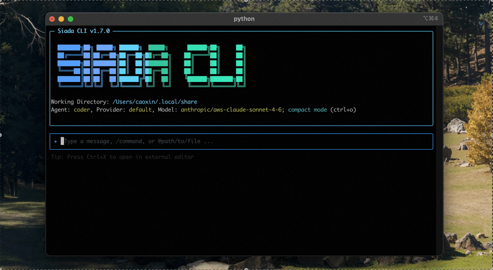

# Siada CLI

**[简体中文](./docs/zh-CN/README_zh.md) | English**

[](https://pypi.org/project/siada-cli/)
[](https://www.python.org/downloads/)
[](LICENSE)



This repository contains **Siada CLI**, a command-line AI workflow tool that provides specialized intelligent agents for code development, debugging, and automation tasks.

Siada CLI is context-aware of your **project**, **computing environment**, and **cross-session persistent memory**, offering consistent, personalized, and continuously improving intelligent assistance across Terminal, Feishu (Lark), ACP clients, and Web interfaces.

> **Current latest version: v1.7.21**

---

## What's New in v1.7.21

### 1. Runs Everywhere, Plugs Into Anything

- **True cross-platform** — fully supported on **macOS, Linux, and Windows**, with a consistent experience on all three. Not a POSIX tool with a compatibility shim: shell execution is platform-native (`pexpect` PTY on Unix, **PowerShell / cmd detection** on Windows), and terminal theme detection, notifications, IPC (Unix socket vs. **named pipe**), daemon spawning, `ripgrep` binaries, and the Node UI bootstrap all have dedicated per-platform paths.
- **Native Feishu (Lark) bot** — a built-in bot transport with streaming cards and typing indicators, so you can drive Siada from chat without writing any glue code. See [Remote Control Guide](./docs/remote_control_lark.md).
- **ACP-native** — ships a standalone [Agent Client Protocol](https://agentclientprotocol.com/) server (`siada-acp`), so Siada drops into any ACP-compatible client (Zed, Kiro, vscode-acp, …) as a first-class agent. Terminal, chat, editor, and Web all talk to the same core.

### 2. Squeezes the Most Out of Every Model

- **On par with the best on frontier models** — on Claude and GPT families, Siada CLI matches leading coding tools such as Claude Code and Codex on real-world code generation and bug fixing.
- **Deeply tuned for domestic/open models** — dedicated engineering for **GLM-5.2**, **DeepSeek V4 Flash / Pro**, **Kimi**, and **Qwen**: reasoning-content replay across multi-turn tool calls, per-model thinking-parameter mapping, per-model context and token budgets, and hallucination/loop suppression for fast models that invent tool names or repeat identical calls.
- **One interface, any provider** — unified provider layer over LiteLLM, plus [custom endpoints](./docs/external_model_configuration.md) for private deployments.

### 3. Long-Horizon Execution and Self-Evolving Memory

- **Long-horizon task execution** — automatic task-complexity judgment, spec-driven Research → Plan → Act pipelines, sub-agent orchestration with clean context windows, checkpoints, and auto-compaction keep goals on track across task chains of hundreds of steps.
- **Self-evolving memory** — cross-session persistent memory combined with a **structured fact store** (entity extraction, holographic/HRR vector retrieval, trust scoring, and contradiction detection) plus a background review-and-update pipeline. Memory is not just an append-only log: it is scored, corrected, and pruned over time.
- **Proactive automation** — run Siada as a background daemon with scheduled tasks so it keeps working, and keeps improving, between your sessions.

---

## What Siada CLI Can Do

- **Code Generation** — Create new features, web interfaces, and refactor code with multi-language support
- **Bug Fixing** — Automatically identify, analyze, and fix code defects in large codebases
- **Long-Horizon Task Execution** — Tackle complex, multi-step development tasks through spec-driven execution and sub-agent orchestration
- **Self-Evolution** — Persistent memory, fact store, and scheduled proactive tasks keep the assistant continuously improving
- **Host Management** — Remote management and processing of your local machine and documents
- **Multi-Entry Support** — Terminal (interactive/non-interactive), Feishu bot, ACP clients, or Web UI

---

## Installation & Update

### System Requirements

| Requirement | Details |
|---|---|
| OS | macOS, Linux, Windows |
| Python | 3.12 – 3.13 |
| GCC | 11+ (macOS / Linux) |
| Package Manager | [uv](https://github.com/astral-sh/uv) |

### Install

**Step 1: Install uv**

macOS / Linux:
```bash
curl -LsSf https://astral.sh/uv/install.sh | sh
```

Windows (PowerShell):
```powershell
powershell -ExecutionPolicy ByPass -c "irm https://astral.sh/uv/install.ps1 | iex"
```

**Step 2: Install Siada CLI** (same command on all platforms)
```bash
uv tool install --force --python python3.12 --compile --with pip siada-cli@latest
```

If `siada-cli` is not found on `PATH` after installation:
```bash
uv tool update-shell
```

### Update
```bash
uv tool upgrade siada-cli
```

### Uninstall
```bash
uv tool uninstall siada-cli
```

---

## Developer Mode Installation

1. **Prerequisites:** Ensure you have [Python 3.12+](https://www.python.org/downloads/) and [Poetry](https://python-poetry.org/docs/#installation) installed.

2. **Clone and Install:**
   ```bash
   git clone https://github.com/liauto-siada/siada-cli.git
   cd siada-cli
   poetry install
   ```

3. **Build UI (required before first run):**
   ```bash
   cd siada_cli_ui && npm ci && npm run build:all && cd ..
   ```

4. **Run CLI:**
   ```bash
   # Method 1: Run with Poetry
   poetry run siada-cli

   # Method 2: Activate virtual environment (recommended)
   source $(poetry env info --path)/bin/activate
   siada-cli
   ```

---

## Configuration

### Quick Model Setup

On first launch, Siada CLI will guide you through an interactive setup — simply select your provider, choose a model, and enter your API key. No manual configuration needed to get started.

For advanced configuration (config file, environment variables, CLI flags), see the [User Manual](./docs/USERMANUAL.md).

For custom external models (private deployments), see [External Model Configuration](./docs/external_model_configuration.md).

---

## Usage Modes

### Interactive Mode (continuous conversation)
```bash
siada-cli
```

### Non-Interactive Mode (script / CI integration)
```bash
siada-cli --no-interactive "Fix the null pointer exception in src/main.py"
```

### Feishu (Lark) Bot
Connect Siada CLI to your Feishu workspace and send tasks from chat — natively supported, with streaming replies. See [Remote Control Guide](./docs/remote_control_lark.md).

### ACP Mode (editor / third-party clients)
Expose Siada over the Agent Client Protocol so any ACP-compatible client can use it:
```bash
siada-acp
```
Or launch the bundled UI over ACP:
```bash
siada-cli --acp
```

---

## Key Features

### Memory System & Fact Store
Cross-session persistent memory lets Siada remember your preferences, codebase context, and past decisions. On top of it, a structured fact store extracts named entities, retrieves via holographic (HRR) vectors, tracks trust scores with feedback, and detects contradictions — so knowledge is refined rather than merely accumulated.

### Checkpoint
Save and restore agent states at key decision points, giving you full control over long-running tasks.

### Skills
Define reusable instruction sets and workflows as `SKILL.md` files that extend Siada's capabilities for your specific domain or team conventions. See [Skills Documentation](./docs/SKILLS.md).

### MCP Support
Connect to external tool servers via the [Model Context Protocol (MCP)](https://modelcontextprotocol.io/) to extend Siada's toolset.

### Daemon & Scheduled Tasks
Run Siada as a background daemon to execute proactive, scheduled automation tasks.

### Instruction Context (Rules)
Place `siada_rule.md` or `.siadarules/` files in your project or home directory to set persistent AI behavior rules without repeating yourself in every conversation.

### Auto Compaction
Intelligently compress conversation history to stay within model context limits without losing critical context. See [Compaction Configuration](./docs/compaction_configuration.md).

### Platform-Aware Tooling
Tool execution adapts to the host OS instead of assuming a single environment: PTY-based shell on macOS/Linux, PowerShell/cmd auto-detection on Windows, platform-specific `ripgrep` binaries, native notifications, and OS-appropriate IPC and daemon handling. Prompts also carry the detected OS so the model generates commands that actually run on your machine.

---

## Documentation

| Document | Description |
|---|---|
| [User Manual](./docs/USERMANUAL.md) | Full usage guide, commands, and configuration |
| [Skills System](./docs/SKILLS.md) | Create and manage reusable AI skills |
| [External Model Config](./docs/external_model_configuration.md) | Configure private/custom model endpoints |
| [Remote Control (Feishu)](./docs/remote_control_lark.md) | Control Siada via Feishu messages |
| [Compaction Configuration](./docs/compaction_configuration.md) | Context compression strategy settings |
| [Contributing Guide](./docs/CONTRIBUTING.md) | How to contribute to this project |

---

## Contributing

We welcome contributions to Siada CLI! Whether you want to fix bugs, add new features, improve documentation, or suggest enhancements, your contributions are greatly appreciated.

Please read our [Contributing Guide](./docs/CONTRIBUTING.md) before submitting:

- Project vision and development goals
- Directory structure and development guidelines
- Pull request guidelines and best practices
- Code organization principles

---

## Acknowledgements

Siada CLI is built upon the foundation of numerous excellent open source projects. We extend our deepest respect and gratitude to their contributors.

Special thanks to:
- [OpenAI Agents SDK](https://github.com/openai/openai-agents-python) — foundational agent framework
- [LiteLLM](https://github.com/BerriAI/litellm) — unified LLM provider interface
- [OpenHands ACI](https://github.com/All-Hands-AI/OpenHands) — agent-computer interface tooling
- [Gemini CLI](https://github.com/google-gemini/gemini-cli) — inspiration for terminal-native AI agent design

For a complete list of open source projects and licenses, see [CREDITS.md](./docs/CREDITS.md).

---

## License

Distributed under the [Apache 2.0 License](LICENSE).

## Disclaimers

See [disclaimers.md](./docs/disclaimers.md).

---

<div align="center">
Built with love by Li Auto Code Intelligence Team and the open source community
</div>
