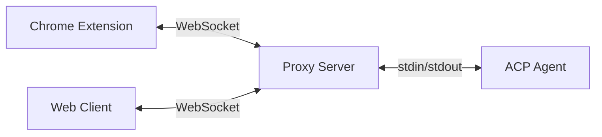

# chrome-acp

The browser addon for **Siada CLI**: a Chrome (MV3) extension plus a local
proxy server that let the Siada agent see and drive the browser session you are
already signed in to.

The CLI installs both parts into `~/.siada-cli/browser/` and manages the proxy
for you:

- the **extension** runs in Chrome (side panel chat, page tools, trajectory
  recording) and connects to the proxy over WebSocket;
- the **proxy server** (`acp-proxy`) spawns the ACP agent subprocess
  (`siada-acp`) and bridges browser ↔ agent, and serves the browser tools to the
  agent over MCP.

Chrome extensions cannot spawn subprocesses — that is what the proxy is for.
See [docs/](./docs) for the rendered documentation site source.

## Architecture



## Install

The normal path is through Siada CLI, from a checkout of this directory:

```bash
# install the proxy + unpacked extension into ~/.siada-cli/browser/
siada-browser setup .

# equivalently, from siada-cli itself
siada-cli --browser-setup .

# then manage the proxy
siada-browser start | stop | restart | status
```

`setup` starts the proxy, opens `chrome://extensions` and prints (also copying
to the clipboard) two things you need once:

1. the unpacked-extension directory to select via **Load unpacked**
   (`~/.siada-cli/browser/extension` on macOS/Linux);
2. the local auth token to paste into the extension's side panel → **Settings**
   (keep it private: it is the credential Chrome uses to reach your local
   siada-cli).

Prebuilt artifacts can be installed from an artifact host with
`siada-browser setup --base-url <url>`; there is no default host in this build,
so without `--base-url` install from a local checkout as above.

### From source

```bash
bun install
bun run build            # all packages (or build:extension / build:proxy / build:web)
bun run dev              # extension with hot reload

# run a proxy against any ACP-capable agent command
node packages/proxy-server/dist/cli/bin.js --no-auth <agent-command>
```

`just pack` produces the same artifacts the CLI installs: a self-contained
proxy tarball (`chrome-acp-proxy-<version>.tar.gz`, dist + public + production
`node_modules`) and the extension zip (`chrome-acp-extension-<version>.zip`),
each with a `.sha256` file.

## Browser tools

The proxy exposes these tools to the agent over MCP (all require the extension):

| Tool | Description |
|------|-------------|
| `browser_tabs` | List all open tabs (id, url, title, active status) |
| `browser_read` | Read a tab's content as simplified Markdown (paginated) |
| `browser_execute` | Execute JavaScript in a tab's page context |
| `browser_replay` | Replay one recorded pipeline step (click/input/select/keydown/scroll/navigate) |
| `browser_screenshot` | Capture the tab's visible viewport and return it as an image |
| `browser_paragraphs` | Extract the main readable paragraphs as an indexed list |
| `browser_annotate` | Render agent-authored content into the page (immersive-translate style) |
| `browser_pdf_render` | Open a PDF (http/https/file) in the built-in pdf.js viewer and screenshot it |

**Usage flow:** the agent lists tabs (`browser_tabs`), reads page content
(`browser_read`, `browser_paragraphs`), then interacts through
`browser_execute` / `browser_replay` — verifying visually with
`browser_screenshot` when needed.

## Trajectory recording

The extension can record what the user does and replay it deterministically:

- `recorder/` — action log, DOM mutation summaries, resilient selectors, and
  input masking (`data-acp-mask`; password inputs are always masked);
- `replay/` — locates a recorded target and performs one pipeline step, both in
  the injected page script and under test;
- `explain/` — explains page content to the agent;
- the proxy writes the trajectory to disk (`trajectory-writer`).

## Proxy options

| Option | Default | Description |
|--------|---------|-------------|
| `--port` | `9315` | Server port |
| `--host` | `localhost` | Host to bind (use `0.0.0.0` for network access) |
| `--https` | `false` | Enable HTTPS with an auto-generated self-signed certificate (required for the camera on mobile) |
| `--public-url` | - | Public WebSocket URL for the QR code (e.g. `wss://example.com/ws`) |
| `--no-auth` | `false` | Disable authentication (safe on localhost, dangerous remotely) |
| `--termux` | `false` | Auto-launch the PWA via Termux on Android |
| `--debug` | `false` | Enable debug logging to file |

## Remote access

To drive the browser from another device (e.g. a phone):

```bash
acp-proxy --https --host 0.0.0.0 <agent-command>
```

The server prints tokenised URLs and a QR code for the mobile client. HTTPS is
required for camera access (QR scanning). See
[docs/docs/guides/remote-access.md](./docs/docs/guides/remote-access.md).

## Agents

The proxy is agent-agnostic: it launches whatever ACP command you give it. In
Siada CLI that command is `siada-acp`, and the CLI starts the proxy with the
right arguments and token for you. See
[docs/docs/guides/supported-agents.md](./docs/docs/guides/supported-agents.md).

## Packages

This is a Bun monorepo with four packages:

| Package | Description |
|---------|-------------|
| [`packages/chrome-extension`](./packages/chrome-extension) | Chrome MV3 extension: side panel chat UI, page tools, recorder/replay/explain |
| [`packages/web-client`](./packages/web-client) | PWA web client served by the proxy server |
| [`packages/shared`](./packages/shared) | Shared UI components and utilities |
| [`packages/proxy-server`](./packages/proxy-server) | WebSocket proxy server + MCP tool bridge (`acp-proxy`) |

## License & attribution

MIT — see [LICENSE](./LICENSE).

This component is derived from the MIT-licensed **Chrome ACP** project
(© 2025 Areo-Joe) and has been modified for Siada CLI: Siada-side
install/manager integration, the browser tools and MCP wiring above, the
trajectory recorder/replay/explain modules, remote-host handling and UI work.
