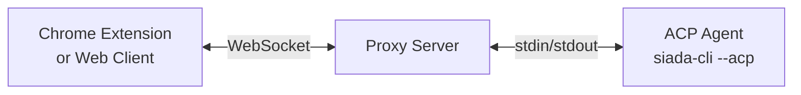

`chrome-acp` is the **browser add-on for Siada CLI**: a Chrome (Manifest V3) extension plus a local proxy server that together let an AI agent chat from your browser and — when you allow it — see and interact with the pages you have open, using your real browser session.

It is built on the [Agent Client Protocol (ACP)](https://agentclientprotocol.com): the proxy spawns an ACP agent as a subprocess and bridges it to the extension's side panel and to a bundled web client (PWA). In Siada CLI that agent is `siada-cli` itself (via its `siada-acp` ACP entry point), so the side panel is an ordinary Siada session with a browser tool belt attached. Any other ACP-capable agent command can be handed to the proxy instead — see [Supported Agents](/guides/supported-agents/).

## Why chrome-acp?

### Managed by Siada CLI

The add-on ships inside this repository (`chrome-acp/`) and is installed, started and stopped from the CLI:

- `siada-browser setup <chrome-acp-dir>` — install the proxy + Chrome extension into `~/.siada-cli/browser/` and start the proxy
- `siada-browser start | stop | restart | status` — manage the running proxy
- `siada-cli --browser-setup <chrome-acp-dir>` / `--browser-start` / `--browser-stop` / `--browser-restart` / `--browser-status` — the same commands without the standalone entry point
- `--browser-port`, `--browser-host`, `--browser-base-url` — tune port, bind address and artifact host

Nothing is published to npm for this component: the installer either copies the built packages out of this repository or downloads prebuilt artifacts from an artifact host you name explicitly with `--base-url` (see [Installation](/getting-started/installation/)).

### siada-cli First, Any ACP Agent Second

Siada CLI's manager always launches the proxy with `siada-cli --acp` as the agent, so the browser side panel gives you your normal Siada experience — memory, skills, MCP servers, tools — plus browser control. Because the proxy itself is agent-agnostic, any ACP-capable command can be used instead:

- **siada-cli** — the default agent, no extra install needed
- **Claude Code** (`claude-code-acp`), **Codex CLI** (`codex-acp`), **OpenCode** (`opencode acp`), **Gemini CLI** (`gemini -- --experimental-acp`), **Qwen Code**, **Augment Code** — generic examples that work with any ACP client
- **Your own agent**, as long as it speaks ACP over stdin/stdout

### Operates as You

Agents interact with web pages using your real browser session. This means:

- No need for separate credentials
- Access to authenticated pages
- Full browser capabilities

### Runs Anywhere Node.js Runs

The proxy is plain Node.js — Bun is used to build the packages, not to run them:

- Your local development machine
- Remote servers
- Even Termux on Android

## How It Works

The **Proxy Server** acts as a bridge between the browser and the AI agent:

1. **Browser → Proxy**: Your messages are sent via WebSocket
2. **Proxy → Agent**: The proxy spawns the agent process and communicates via stdin/stdout
3. **Agent → Browser**: Agent responses flow back through the same path

Browser tools travel the other way over the same WebSocket (proxy → extension → page) and are exposed to the agent as MCP tools — see [Browser Tools](/guides/browser-tools/).

This architecture is necessary because Chrome extensions run in a sandbox and cannot spawn subprocesses directly.

## What Gets Installed

Siada CLI keeps everything under `~/.siada-cli/browser/`:

| Path | Contents |
|------|----------|
| `proxy/` | Built proxy server (`dist/`, `public/`, production `node_modules/`) |
| `extension/` | Unpacked MV3 extension, loaded in Chrome via **Load unpacked** (fixed path — Chrome pins it) |
| `state.json` | `{host, port, token}` — the token is passed to the proxy as `ACP_AUTH_TOKEN` |
| `acp-proxy.log` | Proxy stdout/stderr |
| `proxy.pid` | PID of the running proxy |

The proxy's working directory is `~/.siada-cli/workspace/`, which becomes the side panel's default workspace (file tree + agent sessions).

## Attribution and License

`chrome-acp/` is derived from the MIT-licensed **Chrome ACP** project by **Areo-Joe** and has been modified for Siada CLI: Siada branding and Siada-only features in the extension (PDF viewer, on-page text explanation, page translation/annotation, trajectory recording), `siada-cli` as the default agent, the Python installer/manager in `siada/browser_addon/`, and connection handling tuned for the local setup. The original MIT license text is kept unchanged in `chrome-acp/LICENSE` and continues to cover this component.

## Next Steps

Ready to get started? Head to the [Quick Start](/getting-started/quick-start/) guide.
