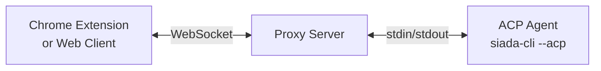

This page describes the technical architecture of `chrome-acp` in detail.

## Overview

The add-on consists of a browser client (Chrome extension, optionally the bundled web client) and a local proxy server that owns the agent subprocess:



Siada CLI sits one level above this picture: the Python side of the monorepo (`siada/browser_addon/`) installs, launches and supervises the proxy, and the proxy in turn launches `siada-cli --acp` for every browser session.

## Why a Proxy Server?

Chrome extensions run in a browser sandbox and **cannot spawn subprocesses**. The proxy server acts as a local bridge that:

1. Spawns the ACP agent subprocess
2. Communicates with the agent via stdin/stdout (NDJSON)
3. Relays messages to/from browser clients via WebSocket
4. Exposes browser tools to agents via MCP

---

## Components

### Chrome Extension

**Location:** `packages/chrome-extension`

A Chrome Manifest V3 extension (displayed as **Siada**) with:

- **Sidepanel UI** - Chat interface in Chrome's side panel
- **Background service worker** - Maintains WebSocket connection to proxy, owns the connection settings and the tool channel
- **Browser tools** - `browser_tabs`, `browser_read`, `browser_execute`, plus the Siada additions (`browser_screenshot`, `browser_replay`, `browser_paragraphs`, `browser_annotate`, `browser_pdf_render`)
- **Content scripts** - Step recorder and the opt-in "explain selection" button
- **Built-in PDF viewer** - pdf.js viewer used when "open PDFs with Siada" is enabled, or when an agent calls `browser_pdf_render`

Uses `chrome.scripting.executeScript()` with `world: "MAIN"` to run scripts in the page's JavaScript context.

### Web Client

**Location:** `packages/web-client`

A Progressive Web App (PWA) served by the proxy server. Features:

- Same chat UI as the extension (shared components)
- No browser tool access (runs in regular web context)
- Mobile-friendly for QR code connections
- Share links: `/app?token=…&session=…&cwd=…` (produced by the `/share` command in the Siada terminal) open straight into an existing session

### Proxy Server

**Location:** `packages/proxy-server`

A Node.js server built with [Hono](https://hono.dev/):

- Serves web client at `/app`
- WebSocket endpoint at `/ws` (agent sessions) and `/ws/trajectory` (recorded step events from the extension)
- MCP endpoint at `/mcp` (Streamable HTTP)
- `/health` and `/status` endpoints, used by `siada-browser status` and by setup verification
- File explorer API for workspace browsing, with its working directory as the workspace root

The proxy is a plain Node.js program (`dist/cli/bin.js`, bin name `acp-proxy`); Bun is only used to build the packages.

### Shared Package

**Location:** `packages/shared`

Shared code used by both chrome-extension and web-client:

- `ACPClient` - WebSocket client for proxy communication
- UI components (shadcn/ui + Vercel AI Elements)
- TypeScript type definitions

### Siada CLI Integration

**Location:** `siada/browser_addon/` (Python side of this monorepo)

- `cli.py` - the `siada-browser` entry point (`setup`, `start`, `stop`, `restart`, `status`), also reachable as `siada-cli --browser-setup | --browser-start | --browser-stop | --browser-restart | --browser-status`, with `--browser-port`, `--browser-host`, `--browser-base-url`
- `installer.py` - copies the built proxy/extension from a checkout (or downloads and SHA-256-verifies prebuilt artifacts from an artifact host) into `~/.siada-cli/browser/`
- `manager.py` - spawns the proxy detached (`start_new_session` on POSIX, `DETACHED_PROCESS` on Windows), persists `{host, port, token}` in `state.json`, probes `/health` and `/status`
- `paths.py` - path resolution (`~/.siada-cli/browser/{proxy,extension,state.json,acp-proxy.log,proxy.pid}`, plus the bundled-Node lookup)

The supervisor builds the proxy command line like this:

```
node ~/.siada-cli/browser/proxy/dist/cli/bin.js \
  --host <host> --port <port> [--https] \
  siada-cli -- --acp
```

with `ACP_AUTH_TOKEN` set from `state.json`, `SIADA_BROWSER_LAUNCH=1` so browser traffic can be told apart in analytics, and the working directory pinned to `~/.siada-cli/workspace`.

---

## WebSocket Protocol

Communication between browser clients and proxy server uses JSON messages.

### Client → Server Messages

| Type | Description |
|------|-------------|
| `connect` | Initial handshake (sends auth token) |
| `new_session` | Request new ACP session |
| `prompt` | Send user message with content blocks |
| `cancel` | Cancel current agent response |
| `set_session_model` | Switch AI model |
| `permission_response` | User response to permission request |
| `browser_tool_result` | Result from browser tool execution |
| `trajectory_events` | Recorded step events from the extension (`/ws/trajectory`) |

### Server → Client Messages

| Type | Description |
|------|-------------|
| `connected` | Connection confirmed |
| `error` | Error occurred |
| `status` | Current agent/connection status |
| `session_created` | New session ready |
| `session_update` | Agent response chunks |
| `prompt_complete` | Agent finished responding |
| `permission_request` | Request user confirmation |
| `browser_tool_call` | Request browser tool execution |
| `model_state` | Available models and current selection |

### Session Update Types

The `session_update` message has different subtypes:

```typescript
type SessionUpdate =
  | { sessionUpdate: "user_message_chunk"; content: ContentBlock }
  | { sessionUpdate: "agent_message_chunk"; content: ContentBlock }
  | { sessionUpdate: "agent_thought_chunk"; content: ContentBlock }
  | { sessionUpdate: "tool_call"; toolCallId: string; title: string; status: string; ... }
  | { sessionUpdate: "tool_call_update"; toolCallId: string; ... };
```

---

## Content Types

Messages support multiple content types:

```typescript
type ContentBlock =
  | { type: "text"; text: string }
  | { type: "image"; mimeType: string; data: string }  // base64
  | { type: "resource_link"; uri: string; mimeType?: string };
```

### Image Support

Agents can declare image support via `promptCapabilities`:

```typescript
interface PromptCapabilities {
  audio?: boolean;
  image?: boolean;
  embeddedContext?: boolean;
}
```

The client checks `promptCapabilities.image` to enable/disable image attachments.

---

## Permission System

Some operations require user confirmation:

```typescript
interface PermissionOption {
  id: string;
  label: string;
  kind: "allow_once" | "allow_always" | "reject_once" | "reject_always";
}
```

Flow:
1. Agent requests operation → Proxy sends `permission_request`
2. UI shows permission buttons → User clicks one
3. Client sends `permission_response` with selected `optionId`
4. Proxy forwards decision → Agent continues or aborts

---

## Model Selection

Agents can expose multiple models:

```typescript
interface SessionModelState {
  availableModels: Array<{
    id: string;
    displayName?: string;
    provider?: string;
  }>;
  currentModelId?: string;
}
```

The UI shows a model selector popover. When user switches:
1. Client sends `set_session_model` with new `modelId`
2. Proxy forwards to agent
3. Agent updates session model

---

## File Explorer

The proxy server provides file system access for workspace browsing:

### List Directory

```typescript
// Request
{ type: "list_dir", path: "/some/path" }

// Response
{
  items: [
    { name: "src", type: "directory" },
    { name: "README.md", type: "file" }
  ]
}
```

### Read File

```typescript
// Request
{ type: "read_file", path: "/some/path/file.txt" }

// Response
{
  path: "/some/path/file.txt",
  content: "file contents...",
  mimeType: "text/plain"
}
```

---

## MCP Integration

Browser tools are exposed to agents via MCP (Model Context Protocol):

- **Transport:** Streamable HTTP at `/mcp`
- **Protocol Version:** `2024-11-05`

The agent is told about this endpoint by the proxy when a session starts, so an ACP agent only has to speak MCP to get browser tools.

### MCP Methods

| Method | Description |
|--------|-------------|
| `initialize` | Protocol handshake |
| `tools/list` | List available browser tools |
| `tools/call` | Execute a browser tool |

### Tool Definitions

```typescript
const BROWSER_TOOLS = [
  {
    name: "browser_tabs",
    description: "List all open tabs...",
    inputSchema: { type: "object", properties: {} }
  },
  {
    name: "browser_read",
    description: "Read the content of a specific tab...",
    inputSchema: {
      type: "object",
      properties: {
        tabId: { type: "number" },
        offset: { type: "number" },
        limit: { type: "number" }
      },
      required: ["tabId"]
    }
  },
  {
    name: "browser_execute",
    description: "Execute JavaScript in a tab...",
    inputSchema: {
      type: "object",
      properties: {
        tabId: { type: "number" },
        script: { type: "string" }
      },
      required: ["tabId", "script"]
    }
  }
];
```

### MCP Flow

```
Agent                    Proxy                   Extension
  │                        │                         │
  │── tools/call ─────────►│                         │
  │   (browser_tabs)       │                         │
  │                        │── browser_tool_call ───►│
  │                        │                         │
  │                        │◄── browser_tool_result ─│
  │                        │    (tabs array)         │
  │◄── MCP response ───────│                         │
```

---

## Tech Stack

| Component | Technology |
|-----------|------------|
| Package Manager | Bun (workspaces) |
| UI Framework | React + TypeScript |
| Styling | Tailwind CSS |
| UI Components | shadcn/ui + Vercel AI Elements |
| Server | Hono (HTTP + WebSocket) |
| Build | Bun (extension), Vite (web-client), tsc (proxy-server) |
| Runtime | Node.js 18+ (the proxy never requires Bun at runtime) |
