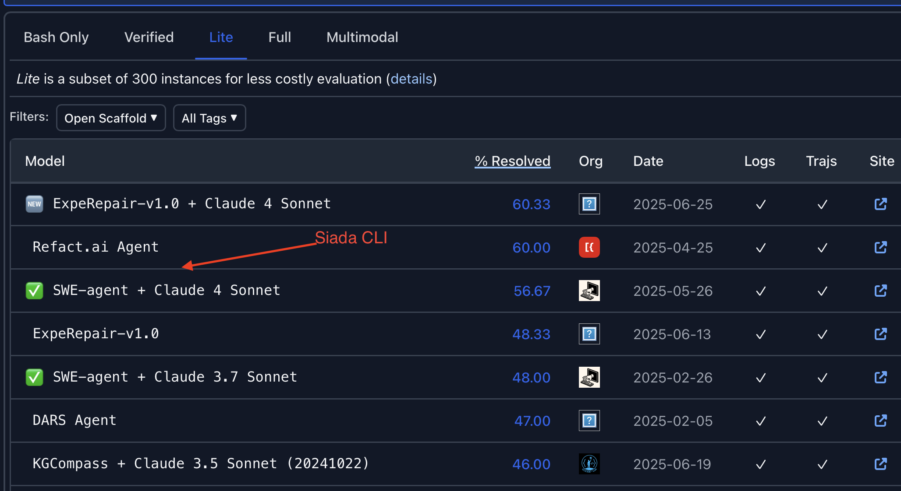

## Introduction

**Siada CLI** is an open-source, command-line AI workflow tool that provides professional intelligent agents for code development, debugging, and automation tasks. Among these, the code generation agent serves as the starting point for all agents within Siada CLI. We believe that code generation based on large language models has the potential to empower every stage of the software engineering lifecycle. Based on this belief, we have conducted internal practice at LI Auto and open-sourced some of the capabilities within Siada CLI.

This report presents our application of Siada CLI to automatically resolve issues in the **SWE-bench-Lite benchmark**. Different from many existing approaches that indiscriminately attempt to solve an issue multiple times, Siada CLI adopts a **three-stage process**—**issue description optimization, bug fixing (including issue reproduction, resolution, and related testing), and patch checking**—to solve issues with minimal model usage and cost.
On the SWE-bench-Lite benchmark, Siada CLI achieved a **57.67% issue resolution rate (173/300)**, **ranking #3 among all models**. The following sections introduce the system design and experimental results of the bug fix agent in Siada CLI.

## System Overview
**Bug Fix of Siada CLI: A Three-Stage, Single-Agent System Design**

In the beginning, we studied and reviewed the designs of various agents listed on the **SWE-Bench leaderboard**, which often use **multiple agents** to generate multiple outputs at different stages and then select from them. For example, we have attempted pipelines involving an issue reproduce agent, test case agent, check agent, and result selection agent. However, these approaches did not yield satisfactory results.

Through experimentation, we discovered that a **direct and clear workflow design**—consisting of **issue description optimization, bug fixing (including issue reproduction, resolution, and associated testing), and patch checking** is more effective at addressing ambiguous model outputs, thereby improving the model's ability to repair bugs.

Specifically:

- To mitigate the negative impact of vague task specifications, as also mentioned in Lingxi, we propose an **issue description optimizer**. It directly ingests the original issue description, clarifies the problem, and provides strategies for reproducing the issue along with boundary test cases. This optimizer does not require tool invocation or iterative interactions, yet effectively enhances the capability of subsequent agents to solve the proble.
- the **bug fix agent** contains **issue reproduction, resolution, and related testing**
- In the **patch check stage**, we verify whether the patched fix aligns with the issue description to decide if the bug needs to be fixed again—this avoids unnecessary repeated model calls that waste computational resources. The checking process follows a **two-phase design**:
    In the **first phase**, the decision of whether to re-run the bug fixing is made solely based on the issue description.
    In the **second phase**, the decision considers both the issue description and the execution trace from the previous bug fix iteration, providing more targeted recommendations to help the next bug fix cycle resolve the issue more precisely.

References

Lingxi v1.5: https://github.com/nimasteryang/Lingxi/blob/master/docs/Lingxi%20v1.5%20Technical%20Report%20200725.pdf

ExpeRepair v1.0: https://github.com/ExpeRepair/ExpeRepair/tree/main/ExpeRepair-v1.0
