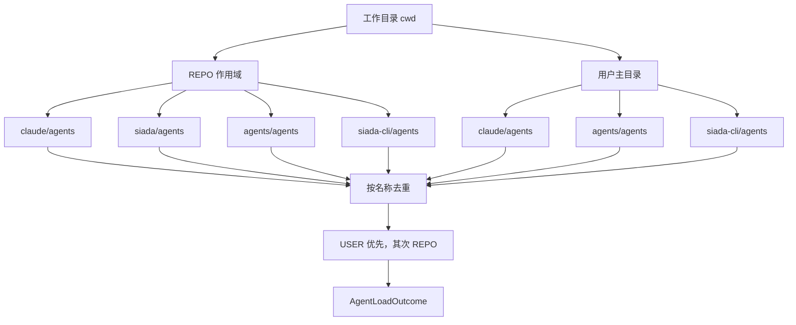
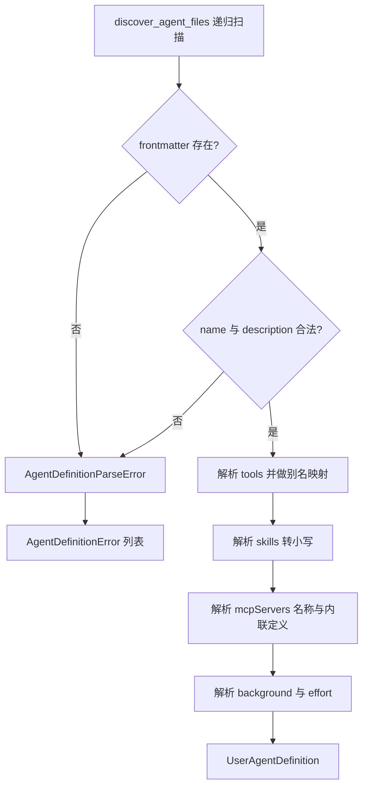

<!-- PAGE_ID: user_agents_01_definition -->
<details>
<summary>📚 Relevant source files</summary>

The following files were used as context for generating this wiki page:

- [config.py:1-108](https://github.com/liauto-siada/siada-cli/blob/0e67ede2d0170b8819086cd02778373b10bfa249/siada/services/agents/config.py#L1-L108)
- [models.py:1-103](https://github.com/liauto-siada/siada-cli/blob/0e67ede2d0170b8819086cd02778373b10bfa249/siada/services/agents/models.py#L1-L103)
- [loader.py:1-340](https://github.com/liauto-siada/siada-cli/blob/0e67ede2d0170b8819086cd02778373b10bfa249/siada/services/agents/loader.py#L1-L340)
- [renderer.py:1-50](https://github.com/liauto-siada/siada-cli/blob/0e67ede2d0170b8819086cd02778373b10bfa249/siada/services/agents/renderer.py#L1-L50)
- [__init__.py:1-117](https://github.com/liauto-siada/siada-cli/blob/0e67ede2d0170b8819086cd02778373b10bfa249/siada/services/agents/__init__.py#L1-L117)
- [code_gen_prompt.py:130-140](https://github.com/liauto-siada/siada-cli/blob/0e67ede2d0170b8819086cd02778373b10bfa249/siada/agent_hub/coder/prompt/code_gen_prompt.py#L130-L140)
- [prompt_builder.py:96-106](https://github.com/liauto-siada/siada-cli/blob/0e67ede2d0170b8819086cd02778373b10bfa249/siada/agent_hub/coder/prompt/base/prompt_builder.py#L96-L106)

</details>

# 用户自定义 Agent 定义

> **Related Pages**: [[用户自定义 Agent 调用链路|02_user-agent-call-graph.md]]

---

<!-- BEGIN:AUTOGEN user_agents_01_definition_format -->
## 定义文件格式与字段

用户自定义 Agent 是一批带 YAML frontmatter 的 Markdown 文件：frontmatter 描述"这个 Agent 是谁、能做什么、用什么配置"，正文（body）则直接成为该 Agent 的系统提示词（[loader.py:250-285](https://github.com/liauto-siada/siada-cli/blob/0e67ede2d0170b8819086cd02778373b10bfa249/siada/services/agents/loader.py#L250-L285)）。解析结果落在 `UserAgentDefinition` 数据类上，字段与 frontmatter 一一对应（[models.py:29-53](https://github.com/liauto-siada/siada-cli/blob/0e67ede2d0170b8819086cd02778373b10bfa249/siada/services/agents/models.py#L29-L53)）。

| 字段 | 类型 | 必填 | 语义与取值 |
|------|------|------|-----------|
| `name` | string | 是 | Agent 类型名，`run_subtask(agent=...)` 用它做查找；超过 64 字符报错（[config.py:22](https://github.com/liauto-siada/siada-cli/blob/0e67ede2d0170b8819086cd02778373b10bfa249/siada/services/agents/config.py#L22), [loader.py:102-126](https://github.com/liauto-siada/siada-cli/blob/0e67ede2d0170b8819086cd02778373b10bfa249/siada/services/agents/loader.py#L102-L126)） |
| `description` | string | 是 | "何时使用该 Agent"，渲染进主 Agent 提示词的 AGENT TYPES 目录；超过 1024 字符报错（[config.py:23](https://github.com/liauto-siada/siada-cli/blob/0e67ede2d0170b8819086cd02778373b10bfa249/siada/services/agents/config.py#L23)） |
| `tools` | list \| 逗号字符串 | 否 | 限定子 Agent 工具集；省略＝默认工具集，`"*"` ＝默认工具集全量（[loader.py:175-180](https://github.com/liauto-siada/siada-cli/blob/0e67ede2d0170b8819086cd02778373b10bfa249/siada/services/agents/loader.py#L175-L180)） |
| `skills` | list \| 逗号字符串 | 否 | 需要预加载的 skill 名称（统一转小写），其 `SKILL.md` 正文会被内联进子 Agent 提示词（[loader.py:278-281](https://github.com/liauto-siada/siada-cli/blob/0e67ede2d0170b8819086cd02778373b10bfa249/siada/services/agents/loader.py#L278-L281)） |
| `mcpServers` | list | 否 | MCP 服务器列表，元素可以是"已配置服务器名"，也可以是内联定义 `{name: {command/url: ...}}`（[loader.py:182-216](https://github.com/liauto-siada/siada-cli/blob/0e67ede2d0170b8819086cd02778373b10bfa249/siada/services/agents/loader.py#L182-L216)） |
| `background` | bool | 否 | `true` 表示该 Agent 每次被 spawn 都走后台任务通道；非法值降级为 `false`（[loader.py:218-235](https://github.com/liauto-siada/siada-cli/blob/0e67ede2d0170b8819086cd02778373b10bfa249/siada/services/agents/loader.py#L218-L235)） |
| `effort` | string | 否 | 推理强度档位，取值 `low` / `medium` / `high` / `xhigh` / `max`；非法值被丢弃（[loader.py:42](https://github.com/liauto-siada/siada-cli/blob/0e67ede2d0170b8819086cd02778373b10bfa249/siada/services/agents/loader.py#L42), [loader.py:237-248](https://github.com/liauto-siada/siada-cli/blob/0e67ede2d0170b8819086cd02778373b10bfa249/siada/services/agents/loader.py#L237-L248)） |
| `model` | string | 否 | 让该 Agent 运行在指定模型上（模型名取自模型目录）；优先于 `conf.yaml` 的 `sub_agent.llm_config.model`，provider 沿用本次 spawn 原本的 provider；`inherit` 等同未配置；未知模型名在运行时被忽略并打 warning（加载阶段只做字符串校验：`loader.py` 的 `_parse_model`，解析与实际应用分离，运行由 `sub_agent_run_config.py` 的 `_model_override_llm_config` 校验） |

容错策略刻意分成两档：`name` / `description` 缺失或类型错误会让该文件整体加载失败并记录一条 `AgentDefinitionError`（[models.py:65-72](https://github.com/liauto-siada/siada-cli/blob/0e67ede2d0170b8819086cd02778373b10bfa249/siada/services/agents/models.py#L65-L72)）；其余字段非法只降级该字段（丢弃并打 warning），不影响整个定义可用（[loader.py:182-248](https://github.com/liauto-siada/siada-cli/blob/0e67ede2d0170b8819086cd02778373b10bfa249/siada/services/agents/loader.py#L182-L248)）。

frontmatter 本身也做了一层宽容解析：严格 YAML 解析失败时，`_load_lenient_frontmatter` 会把"顶层纯量值里含 `": "`"的行补上引号后重试（第三方 Agent 包常见的 `description: ... Triggers on: 'x'` 写法），流式集合与嵌套行保持原样；确实无法恢复的才报错（[loader.py:81-126](https://github.com/liauto-siada/siada-cli/blob/0e67ede2d0170b8819086cd02778373b10bfa249/siada/services/agents/loader.py#L81-L126)）。工具名映射后会去重并保持顺序，`Read, Write, Edit, Bash, Glob, Grep` 得到 `read_file, edit_file, run_cmd, regex_search_files`（[loader.py:164-175](https://github.com/liauto-siada/siada-cli/blob/0e67ede2d0170b8819086cd02778373b10bfa249/siada/services/agents/loader.py#L164-L175)）。

`tools` 还带一层兼容映射：Claude Code 风格的工具名（`Read`、`Bash`、`Grep`、`Task` 等）会被翻译成 Siada 工具名，未命中的名字原样保留（[loader.py:47-64](https://github.com/liauto-siada/siada-cli/blob/0e67ede2d0170b8819086cd02778373b10bfa249/siada/services/agents/loader.py#L47-L64), [loader.py:164-173](https://github.com/liauto-siada/siada-cli/blob/0e67ede2d0170b8819086cd02778373b10bfa249/siada/services/agents/loader.py#L164-L173)）。

```markdown
---
name: code-reviewer
description: Reviews diffs for bugs, style and security issues.
tools: [read_file, regex_search_files, run_cmd]
skills: [wiki]
mcpServers:
  - lark
background: true
effort: high
model: gpt-6-luna
---

You are a meticulous code reviewer. Report findings with file:line references.
```

Sources: [models.py:29-63](https://github.com/liauto-siada/siada-cli/blob/0e67ede2d0170b8819086cd02778373b10bfa249/siada/services/agents/models.py#L29-L63), [loader.py:175-285](https://github.com/liauto-siada/siada-cli/blob/0e67ede2d0170b8819086cd02778373b10bfa249/siada/services/agents/loader.py#L175-L285)
<!-- END:AUTOGEN user_agents_01_definition_format -->

---

<!-- BEGIN:AUTOGEN user_agents_01_definition_discovery -->
## 加载路径与优先级

定义文件统一放在 `agents/` 子目录下，搜索路径与 skill 加载器保持同一套兼容布局：仓库级（REPO）搜索 `.claude/agents` → `.siada/agents` → `.agents/agents` → `.siada-cli/agents`，用户级（USER）搜索 `~/.claude/agents` → `~/.agents/agents` → `~/.siada-cli/agents`（[config.py:39-75](https://github.com/liauto-siada/siada-cli/blob/0e67ede2d0170b8819086cd02778373b10bfa249/siada/services/agents/config.py#L39-L75), [config.py:96-108](https://github.com/liauto-siada/siada-cli/blob/0e67ede2d0170b8819086cd02778373b10bfa249/siada/services/agents/config.py#L96-L108)）。

优先级是"两条轴"叠加的（[loader.py:303-334](https://github.com/liauto-siada/siada-cli/blob/0e67ede2d0170b8819086cd02778373b10bfa249/siada/services/agents/loader.py#L303-L334)）：

- **同一作用域内**：列表中靠后的根目录覆盖靠前的（last-write-wins），因此规范布局 `.siada-cli/agents` 胜过兼容布局。
- **跨作用域**：`AgentScope` 数值更小者优先（`USER = 0` > `REPO = 1`），高优先级作用域已提供的同名 Agent 会让低优先级的定义被静默遮蔽并打 debug 日志（[models.py:17-27](https://github.com/liauto-siada/siada-cli/blob/0e67ede2d0170b8819086cd02778373b10bfa249/siada/services/agents/models.py#L17-L27), [loader.py:322-331](https://github.com/liauto-siada/siada-cli/blob/0e67ede2d0170b8819086cd02778373b10bfa249/siada/services/agents/loader.py#L322-L331)）。
- 查找按名称**大小写不敏感**，结果按名称排序输出（[models.py:74-95](https://github.com/liauto-siada/siada-cli/blob/0e67ede2d0170b8819086cd02778373b10bfa249/siada/services/agents/models.py#L74-L95), [loader.py:333](https://github.com/liauto-siada/siada-cli/blob/0e67ede2d0170b8819086cd02778373b10bfa249/siada/services/agents/loader.py#L333)）。



Sources: [config.py:77-108](https://github.com/liauto-siada/siada-cli/blob/0e67ede2d0170b8819086cd02778373b10bfa249/siada/services/agents/config.py#L77-L108), [loader.py:303-340](https://github.com/liauto-siada/siada-cli/blob/0e67ede2d0170b8819086cd02778373b10bfa249/siada/services/agents/loader.py#L303-L340)
<!-- END:AUTOGEN user_agents_01_definition_discovery -->

---

<!-- BEGIN:AUTOGEN user_agents_01_definition_parse -->
## 解析流程与错误处理

解析入口是 `parse_agent_file`：读文件 → 用与 skill 加载器同形的正则抓 frontmatter（[loader.py:35-39](https://github.com/liauto-siada/siada-cli/blob/0e67ede2d0170b8819086cd02778373b10bfa249/siada/services/agents/loader.py#L35-L39)）→ 校验 `name` / `description` → 逐字段解析 → 组装 `UserAgentDefinition`，其中正文经 `strip_frontmatter` 去掉 frontmatter 并 trim（[loader.py:94-99](https://github.com/liauto-siada/siada-cli/blob/0e67ede2d0170b8819086cd02778373b10bfa249/siada/services/agents/loader.py#L94-L99), [loader.py:250-285](https://github.com/liauto-siada/siada-cli/blob/0e67ede2d0170b8819086cd02778373b10bfa249/siada/services/agents/loader.py#L250-L285)）。

文件发现是递归的：`discover_agent_files` 会深入子目录收集所有 `*.md`，并容忍 `PermissionError`（[loader.py:66-79](https://github.com/liauto-siada/siada-cli/blob/0e67ede2d0170b8819086cd02778373b10bfa249/siada/services/agents/loader.py#L66-L79)）。单个根目录的加载把成功与失败分开累积，一个坏文件不会让同目录其它 Agent 消失（[loader.py:288-300](https://github.com/liauto-siada/siada-cli/blob/0e67ede2d0170b8819086cd02778373b10bfa249/siada/services/agents/loader.py#L288-L300)）。



Sources: [loader.py:66-79](https://github.com/liauto-siada/siada-cli/blob/0e67ede2d0170b8819086cd02778373b10bfa249/siada/services/agents/loader.py#L66-L79), [loader.py:250-300](https://github.com/liauto-siada/siada-cli/blob/0e67ede2d0170b8819086cd02778373b10bfa249/siada/services/agents/loader.py#L250-L300)
<!-- END:AUTOGEN user_agents_01_definition_parse -->

---

<!-- BEGIN:AUTOGEN user_agents_01_definition_prompt -->
## 主 Agent 提示词注入

主 Agent 必须"知道自己有哪些命名 Agent 可派"，否则 `run_subtask(agent=...)` 永远不会被使用。这一步由 `render_agents_section` 完成：把每个定义的 `name` 与 `description` 渲染成 AGENT TYPES 段，并给出 `agent: "<name>"` 的调用提示（[renderer.py:17-50](https://github.com/liauto-siada/siada-cli/blob/0e67ede2d0170b8819086cd02778373b10bfa249/siada/services/agents/renderer.py#L17-L50)）。

- 没有任何定义时返回 `None`，调用方直接跳过该段——**默认提示词零改动**，不引入额外的 prompt cache 抖动（[renderer.py:26-28](https://github.com/liauto-siada/siada-cli/blob/0e67ede2d0170b8819086cd02778373b10bfa249/siada/services/agents/renderer.py#L26-L28), [__init__.py:68-75](https://github.com/liauto-siada/siada-cli/blob/0e67ede2d0170b8819086cd02778373b10bfa249/siada/services/agents/__init__.py#L68-L75)）。
- 段落有 4000 字符预算，超出的条目折叠为 "N more agent(s) omitted"，防止大量定义挤占提示词（[renderer.py:15](https://github.com/liauto-siada/siada-cli/blob/0e67ede2d0170b8819086cd02778373b10bfa249/siada/services/agents/renderer.py#L15), [renderer.py:30-45](https://github.com/liauto-siada/siada-cli/blob/0e67ede2d0170b8819086cd02778373b10bfa249/siada/services/agents/renderer.py#L30-L45)）。
- 渲染入口 `get_agents_section(cwd)` 在每次构建系统提示词时被调用（`code_gen_prompt.get_system_prompt`），结果作为 `agents_section` 传入 `build_system_prompt`，插在 skills 段之后；**仅当子 Agent 功能开启时才会注入**——`sub_agent.enabled: false` 时 `run_subtask` 工具本身已移除，提示词里也不再出现 AGENT TYPES 或 `run_subtask` 字样（[code_gen_prompt.py:131-143](https://github.com/liauto-siada/siada-cli/blob/0e67ede2d0170b8819086cd02778373b10bfa249/siada/agent_hub/coder/prompt/code_gen_prompt.py#L131-L143), [prompt_builder.py:100-105](https://github.com/liauto-siada/siada-cli/blob/0e67ede2d0170b8819086cd02778373b10bfa249/siada/agent_hub/coder/prompt/base/prompt_builder.py#L100-L105)）。

```text
====

AGENT TYPES

The following user-defined agents can be launched with the `run_subtask` tool by
passing `agent: "<name>"`. ...

Available agents (name — description):
- `code-reviewer` — Reviews diffs for bugs, style and security issues.
```

Sources: [renderer.py:15-50](https://github.com/liauto-siada/siada-cli/blob/0e67ede2d0170b8819086cd02778373b10bfa249/siada/services/agents/renderer.py#L15-L50), [code_gen_prompt.py:130-140](https://github.com/liauto-siada/siada-cli/blob/0e67ede2d0170b8819086cd02778373b10bfa249/siada/agent_hub/coder/prompt/code_gen_prompt.py#L130-L140)
<!-- END:AUTOGEN user_agents_01_definition_prompt -->

---
