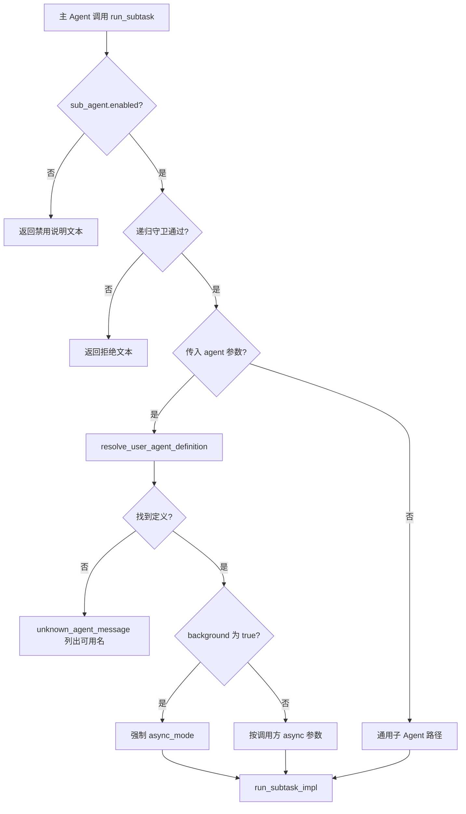
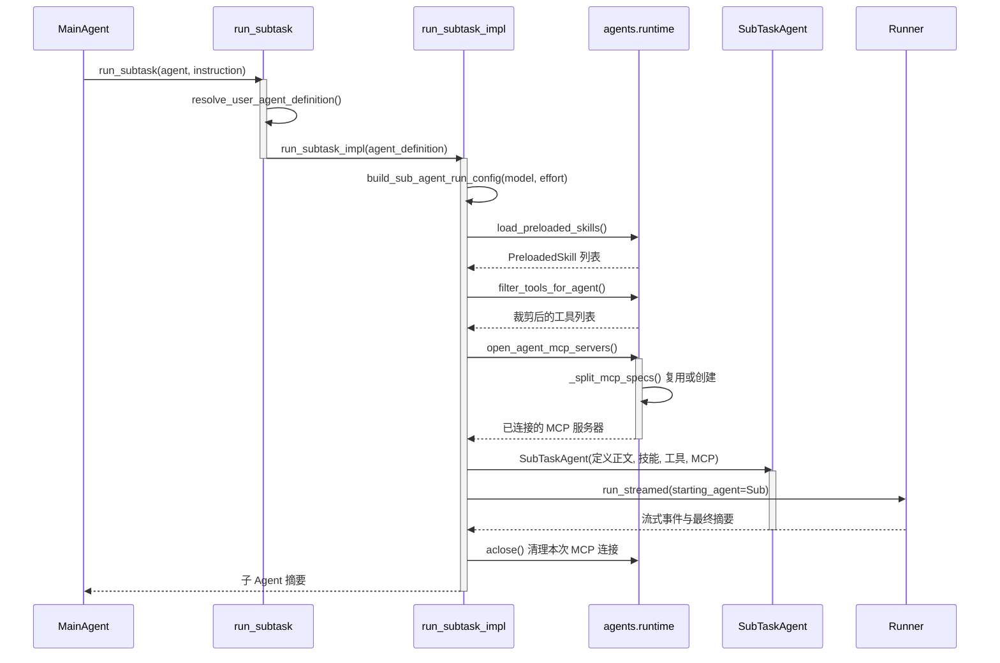
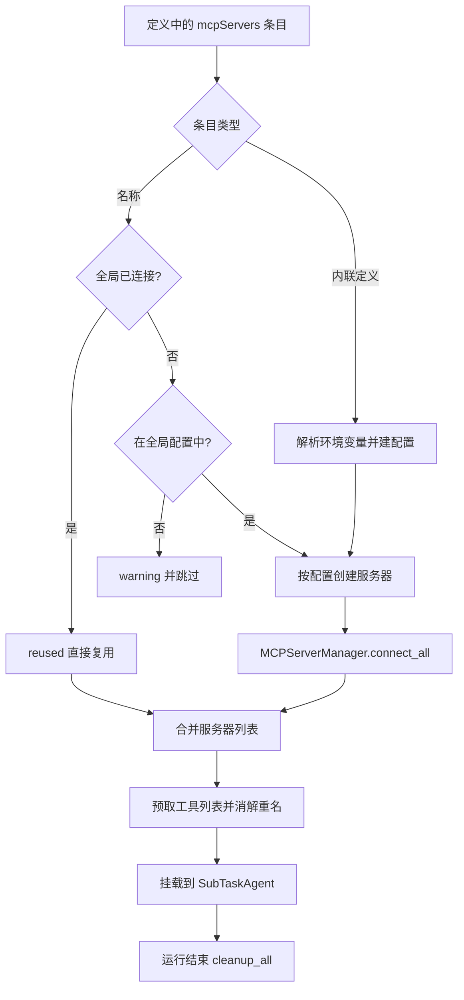

<!-- PAGE_ID: user_agents_02_call_graph -->

📚 Relevant source files

The following files were used as context for generating this wiki page:

- [run_subtask.py:1-720](https://github.com/liauto-siada/siada-cli/blob/0e67ede2d0170b8819086cd02778373b10bfa249/siada/tools/agent/run_subtask.py#L1-L720)
- [runtime.py:1-327](https://github.com/liauto-siada/siada-cli/blob/0e67ede2d0170b8819086cd02778373b10bfa249/siada/services/agents/runtime.py#L1-L327)
- [sub_task_agent.py:1-307](https://github.com/liauto-siada/siada-cli/blob/0e67ede2d0170b8819086cd02778373b10bfa249/siada/agent_hub/coder/sub_task_agent.py#L1-L307)
- [sub_agent_run_config.py:1-192](https://github.com/liauto-siada/siada-cli/blob/0e67ede2d0170b8819086cd02778373b10bfa249/siada/services/sub_agent_run_config.py#L1-L192)

# 用户自定义 Agent 调用链路

> **Related Pages**: [[用户自定义 Agent 定义|01_user-agent-definition.md]]

---

<!-- BEGIN:AUTOGEN user_agents_02_entry -->
## 工具入口与参数解析

调用链起点是 `run_subtask` 工具新增的 `agent` 参数：主 Agent 在系统提示词的 AGENT TYPES 段里看到候选名字后，用 `agent: "<name>"` 指定要派出的 Agent，不传则退回通用子 Agent（[run_subtask.py:89-116](https://github.com/liauto-siada/siada-cli/blob/0e67ede2d0170b8819086cd02778373b10bfa249/siada/tools/agent/run_subtask.py#L89-L116), [run_subtask.py:611-618](https://github.com/liauto-siada/siada-cli/blob/0e67ede2d0170b8819086cd02778373b10bfa249/siada/tools/agent/run_subtask.py#L611-L618)）。

解析顺序固定在守卫之后：先过 `sub_agent.enabled` 总开关、再过子 Agent 递归守卫，然后才查定义（[run_subtask.py:620-652](https://github.com/liauto-siada/siada-cli/blob/0e67ede2d0170b8819086cd02778373b10bfa249/siada/tools/agent/run_subtask.py#L620-L652)）。查不到名字时**不抛异常**，而是返回一段模型可读的文本：列出当前可用的 Agent 名，或提示定义目录，让主 Agent 在同一轮里自我纠正（[run_subtask.py:136-153](https://github.com/liauto-siada/siada-cli/blob/0e67ede2d0170b8819086cd02778373b10bfa249/siada/tools/agent/run_subtask.py#L136-L153)）。

Sources: [run_subtask.py:119-153](https://github.com/liauto-siada/siada-cli/blob/0e67ede2d0170b8819086cd02778373b10bfa249/siada/tools/agent/run_subtask.py#L119-L153), [run_subtask.py:611-706](https://github.com/liauto-siada/siada-cli/blob/0e67ede2d0170b8819086cd02778373b10bfa249/siada/tools/agent/run_subtask.py#L611-L706)
<!-- END:AUTOGEN user_agents_02_entry -->

---

<!-- BEGIN:AUTOGEN user_agents_02_spawn -->
## run_subtask_impl 调用链路

`run_subtask_impl` 收到 `agent_definition` 后，五件事按固定顺序发生（[run_subtask.py:261-317](https://github.com/liauto-siada/siada-cli/blob/0e67ede2d0170b8819086cd02778373b10bfa249/siada/tools/agent/run_subtask.py#L261-L317), [run_subtask.py:408-496](https://github.com/liauto-siada/siada-cli/blob/0e67ede2d0170b8819086cd02778373b10bfa249/siada/tools/agent/run_subtask.py#L408-L496)）：

1. **fork 被忽略**：定义自带工具与提示词，父会话的前缀缓存无法复用，因此打 warning 后把 `fork` 置回 `False`。
2. **RunConfig 带上 model 与 effort**：`build_sub_agent_run_config(context, effort=definition.effort, model=definition.model)` —— 定义的 `model` 在 `conf.yaml` 子 Agent 模型之上生效（模型名不在模型目录中时忽略覆盖并打 warning），provider 沿用本次 spawn 原本的 provider（[sub_agent_run_config.py:142-176](https://github.com/liauto-siada/siada-cli/blob/0e67ede2d0170b8819086cd02778373b10bfa249/siada/services/sub_agent_run_config.py#L142-L176)）。
3. **定义落地**：`load_preloaded_skills(...)` 读技能正文，`filter_tools_for_agent(_build_default_tools(...), definition)` 得到该 Agent 的工具集（[run_subtask.py:414-441](https://github.com/liauto-siada/siada-cli/blob/0e67ede2d0170b8819086cd02778373b10bfa249/siada/tools/agent/run_subtask.py#L414-L441)）。
4. **MCP 连接**：`AsyncExitStack.enter_async_context(open_agent_mcp_servers(definition))`，把服务器挂到本次运行的 Agent 上（[run_subtask.py:468-481](https://github.com/liauto-siada/siada-cli/blob/0e67ede2d0170b8819086cd02778373b10bfa249/siada/tools/agent/run_subtask.py#L468-L481)）。
5. **组装并运行**：构造 `SubTaskAgent(definition_prompt=..., preloaded_skills=..., mcp_servers=..., tools_override=...)`，交给 `Runner.run_streamed`；流式事件仍只推送到子 Agent 详情视图（[run_subtask.py:483-504](https://github.com/liauto-siada/siada-cli/blob/0e67ede2d0170b8819086cd02778373b10bfa249/siada/tools/agent/run_subtask.py#L483-L504)）。

无论成功、失败还是取消，`finally` 都会 `await mcp_stack.aclose()` 回收本次现场创建并连接的 MCP 服务器（[run_subtask.py:550-581](https://github.com/liauto-siada/siada-cli/blob/0e67ede2d0170b8819086cd02778373b10bfa249/siada/tools/agent/run_subtask.py#L550-L581)）。

Sources: [run_subtask.py:261-317](https://github.com/liauto-siada/siada-cli/blob/0e67ede2d0170b8819086cd02778373b10bfa249/siada/tools/agent/run_subtask.py#L261-L317), [run_subtask.py:408-581](https://github.com/liauto-siada/siada-cli/blob/0e67ede2d0170b8819086cd02778373b10bfa249/siada/tools/agent/run_subtask.py#L408-L581)
<!-- END:AUTOGEN user_agents_02_spawn -->

---

<!-- BEGIN:AUTOGEN user_agents_02_tools -->
## 工具裁剪（tools）

`filter_tools_for_agent` 接收"默认子 Agent 工具集"和定义，返回本次实际暴露的工具列表（[runtime.py:49-103](https://github.com/liauto-siada/siada-cli/blob/0e67ede2d0170b8819086cd02778373b10bfa249/siada/services/agents/runtime.py#L49-L103)）：

- `tools` 省略或含 `"*"`：原样返回默认工具集。
- 否则按名称（大小写不敏感）过滤；未知名称打 warning 后丢弃。
- **兜底**：若过滤后一个都不剩，退回默认工具集——照搬其它 CLI 工具词汇的定义不会产出一个"没有工具"的 Agent。
- **文件工具组**：`read_file` / `edit_file` / `apply_patch` 视为一组。因为原生 patch 模型暴露 `read_file` + `apply_patch`，其它模型只暴露 `edit_file`，命中组内任一名字就保留默认集中实际存在的成员，定义可跨模型复用（[runtime.py:42-46](https://github.com/liauto-siada/siada-cli/blob/0e67ede2d0170b8819086cd02778373b10bfa249/siada/services/agents/runtime.py#L42-L46), [runtime.py:65-67](https://github.com/liauto-siada/siada-cli/blob/0e67ede2d0170b8819086cd02778373b10bfa249/siada/services/agents/runtime.py#L65-L67)）。

默认工具集本身由 `_build_default_tools` 按有效子 Agent 模型生成（web 工具、`run_subtask` 递归开关都参与），裁剪发生在其之后（[sub_task_agent.py:189-231](https://github.com/liauto-siada/siada-cli/blob/0e67ede2d0170b8819086cd02778373b10bfa249/siada/agent_hub/coder/sub_task_agent.py#L189-L231), [run_subtask.py:427-434](https://github.com/liauto-siada/siada-cli/blob/0e67ede2d0170b8819086cd02778373b10bfa249/siada/tools/agent/run_subtask.py#L427-L434)）。

Sources: [runtime.py:42-103](https://github.com/liauto-siada/siada-cli/blob/0e67ede2d0170b8819086cd02778373b10bfa249/siada/services/agents/runtime.py#L42-L103), [sub_task_agent.py:189-231](https://github.com/liauto-siada/siada-cli/blob/0e67ede2d0170b8819086cd02778373b10bfa249/siada/agent_hub/coder/sub_task_agent.py#L189-L231)
<!-- END:AUTOGEN user_agents_02_tools -->

---

<!-- BEGIN:AUTOGEN user_agents_02_skills -->
## skills 预加载

`load_preloaded_skills` 走的是主 Agent 目录同源的 `SkillsManager` 单例，因此 `.agents/skills`、`.siada-cli/skills`、插件技能都能被引用；找不到的名字打 warning 后跳过，读文件失败也只跳过该技能，不会阻断 spawn（[runtime.py:105-153](https://github.com/liauto-siada/siada-cli/blob/0e67ede2d0170b8819086cd02778373b10bfa249/siada/services/agents/runtime.py#L105-L153)）。

预加载的语义是"内容内联"：读取 `SKILL.md` 后用 `strip_frontmatter` 去掉 frontmatter，得到 `PreloadedSkill(name, path, content)`（[runtime.py:29-35](https://github.com/liauto-siada/siada-cli/blob/0e67ede2d0170b8819086cd02778373b10bfa249/siada/services/agents/runtime.py#L29-L35)）。`SubTaskAgent` 的提示词组装阶段把这些内容渲染成 `## Preloaded Skills` 段，子 Agent 无需再去目录里翻文件（[sub_task_agent.py:121-141](https://github.com/liauto-siada/siada-cli/blob/0e67ede2d0170b8819086cd02778373b10bfa249/siada/agent_hub/coder/sub_task_agent.py#L121-L141), [sub_task_agent.py:109-118](https://github.com/liauto-siada/siada-cli/blob/0e67ede2d0170b8819086cd02778373b10bfa249/siada/agent_hub/coder/sub_task_agent.py#L109-L118)）。预加载段之外，原有"技能目录提示"仍然保留，子 Agent 仍可主动读取其它技能。

Sources: [runtime.py:29-153](https://github.com/liauto-siada/siada-cli/blob/0e67ede2d0170b8819086cd02778373b10bfa249/siada/services/agents/runtime.py#L29-L153), [sub_task_agent.py:109-141](https://github.com/liauto-siada/siada-cli/blob/0e67ede2d0170b8819086cd02778373b10bfa249/siada/agent_hub/coder/sub_task_agent.py#L109-L141)
<!-- END:AUTOGEN user_agents_02_skills -->

---

<!-- BEGIN:AUTOGEN user_agents_02_mcp -->
## mcpServers 解析与连接

MCP 解析的核心是"**能用现成的就不重连**"：`_split_mcp_specs` 把定义里的条目拆成 `reused`（全局 MCP 管理器已连接的服务器对象）与 `to_create`（需要现场创建并连接的服务器）（[runtime.py:213-266](https://github.com/liauto-siada/siada-cli/blob/0e67ede2d0170b8819086cd02778373b10bfa249/siada/services/agents/runtime.py#L213-L266)）：

- 名称命中全局已连接表 → 直接复用，不重复连接（对 lark 这类带 OAuth/令牌刷新的服务器尤其重要）。
- 名称命中全局配置但未连接 → 用 `MCPServerFactory.create_server` 按配置创建。
- 内联定义 `{name: {...}}` → 先做环境变量解析，再转成 `MCPServerConfig` 后创建；配置里 `enabled: false` 的服务器会被跳过。
- 既不在配置里也不是内联定义的名称 → warning 并跳过。

连接阶段用 SDK 的 `MCPServerManager`（10s 连接/清理超时、`drop_failed_servers=True`、`strict=False`），随后对服务器预取工具列表并跑一次工具名冲突消解，避免 MCP 工具覆盖 Siada 原生工具名；`finally` 里 `cleanup_all()` 只清理本次创建的连接（[runtime.py:269-327](https://github.com/liauto-siada/siada-cli/blob/0e67ede2d0170b8819086cd02778373b10bfa249/siada/services/agents/runtime.py#L269-L327)）。挂载到子 Agent 时会同时设置 `mcp_config = {"convert_schemas_to_strict": True}`，与主 Agent 的严格性策略一致（[sub_task_agent.py:282-293](https://github.com/liauto-siada/siada-cli/blob/0e67ede2d0170b8819086cd02778373b10bfa249/siada/agent_hub/coder/sub_task_agent.py#L282-L293)）。

Sources: [runtime.py:179-327](https://github.com/liauto-siada/siada-cli/blob/0e67ede2d0170b8819086cd02778373b10bfa249/siada/services/agents/runtime.py#L179-L327), [run_subtask.py:468-481](https://github.com/liauto-siada/siada-cli/blob/0e67ede2d0170b8819086cd02778373b10bfa249/siada/tools/agent/run_subtask.py#L468-L481)
<!-- END:AUTOGEN user_agents_02_mcp -->

---

<!-- BEGIN:AUTOGEN user_agents_02_effort -->
## effort 映射与 RunConfig

`effort` 不直接写进请求，而是先按**有效子 Agent 模型**映射档位：`resolve_effort_for_model` 调用 `coerce_reasoning_effort`，把模型不接受的档位映射到最接近（同距离取更强）的邻居，未知档位回退模型默认值（[runtime.py:161-171](https://github.com/liauto-siada/siada-cli/blob/0e67ede2d0170b8819086cd02778373b10bfa249/siada/services/agents/runtime.py#L161-L171)）。例如 GLM-5.3 只接受 `low/high/max`，定义里的 `medium` 会落到 `high`。

关键细节是**不污染父会话**：`resolve_sub_agent_llm_config` 通常直接返回父会话的 `ModelRunConfig` 对象，因此 `_with_reasoning_effort` 先 `copy.copy` 再 `set_reasoning_effort`，只改副本；之后 `ModelSettingsConverter.convert_model_settings` 按模型族把档位落到 `extra_args`（Claude 4.6+ 的 `output_config.effort`）或 `extra_body.reasoning_effort`（[sub_agent_run_config.py:114-137](https://github.com/liauto-siada/siada-cli/blob/0e67ede2d0170b8819086cd02778373b10bfa249/siada/services/sub_agent_run_config.py#L114-L137), [sub_agent_run_config.py:142-176](https://github.com/liauto-siada/siada-cli/blob/0e67ede2d0170b8819086cd02778373b10bfa249/siada/services/sub_agent_run_config.py#L142-L176)）。

同一处还会先应用定义里的 `model`：`build_sub_agent_run_config` 在 `resolve_sub_agent_llm_config` 的结果之上，用 `_model_override_llm_config` 构造覆盖配置——模型名不在模型目录中时忽略覆盖并打 warning（不落到静默默认模型），provider 始终沿用本次 spawn 原本的 provider；`effort` 随后按这个有效模型映射档位，两者叠加时 `model` 先生效。

Sources: [runtime.py:161-171](https://github.com/liauto-siada/siada-cli/blob/0e67ede2d0170b8819086cd02778373b10bfa249/siada/services/agents/runtime.py#L161-L171), [sub_agent_run_config.py:114-176](https://github.com/liauto-siada/siada-cli/blob/0e67ede2d0170b8819086cd02778373b10bfa249/siada/services/sub_agent_run_config.py#L114-L176)
<!-- END:AUTOGEN user_agents_02_effort -->

---

<!-- BEGIN:AUTOGEN user_agents_02_background -->
## background 强制后台

`background: true` 的定义在工具入口就把本次 spawn 切到后台通道：`async_mode` 被强制置为 `True`，随后走 `register_background_subtask(agent_context, _run_and_release)` 注册后台任务并立刻返回 `task_id`，摘要稍后以通知形式回到主 Agent（[run_subtask.py:678-707](https://github.com/liauto-siada/siada-cli/blob/0e67ede2d0170b8819086cd02778373b10bfa249/siada/tools/agent/run_subtask.py#L678-L707)）。

需要注意两处边界：调用方显式传 `async: false` 时定义仍然生效（定义优先，只记一条 info 日志）；而递归模式的并发槽位由 `_run_and_release` 的 `finally` 释放，与是否后台无关（[run_subtask.py:687-720](https://github.com/liauto-siada/siada-cli/blob/0e67ede2d0170b8819086cd02778373b10bfa249/siada/tools/agent/run_subtask.py#L687-L720)）。

Sources: [run_subtask.py:678-720](https://github.com/liauto-siada/siada-cli/blob/0e67ede2d0170b8819086cd02778373b10bfa249/siada/tools/agent/run_subtask.py#L678-L720)
<!-- END:AUTOGEN user_agents_02_background -->

---

<!-- BEGIN:AUTOGEN user_agents_02_prompt -->
## SubTaskAgent 提示词组装

子 Agent 的系统提示词由 `_build_subtask_instructions` 按固定顺序拼装（[sub_task_agent.py:80-118](https://github.com/liauto-siada/siada-cli/blob/0e67ede2d0170b8819086cd02778373b10bfa249/siada/agent_hub/coder/sub_task_agent.py#L80-L118)）：

1. **基础系统提示词**（`_SUBTASK_SYSTEM_PROMPT_BASE` = 身份说明 + 无人值守规则）永远排在最前——子 Agent 不能向用户提问、不得扩大范围、结束必须给摘要，这些是运行时不变式，不随定义改变。
2. **定义正文**（`definition_prompt`）通过 `====` 分隔符追加在基础提示词之后，Agent 的人格与职责来自用户文件（[sub_task_agent.py:99-107](https://github.com/liauto-siada/siada-cli/blob/0e67ede2d0170b8819086cd02778373b10bfa249/siada/agent_hub/coder/sub_task_agent.py#L99-L107)）。
3. **工作目录 / 递归提示 / 文件工具契约**：沿用原有逻辑。
4. **预加载技能**（有则插入 `## Preloaded Skills`）与技能目录提示。

无定义时 `head` 直接就是基础提示词，与改造前逐字一致（[sub_task_agent.py:25-54](https://github.com/liauto-siada/siada-cli/blob/0e67ede2d0170b8819086cd02778373b10bfa249/siada/agent_hub/coder/sub_task_agent.py#L25-L54)）。

`SubTaskAgent.__init__` 相应新增 `definition_prompt` / `preloaded_skills` / `mcp_servers` / `tools_override` 四个参数，其中 `tools_override` 的优先级低于 `fork_tools`（fork 与定义不会同时生效）（[sub_task_agent.py:256-307](https://github.com/liauto-siada/siada-cli/blob/0e67ede2d0170b8819086cd02778373b10bfa249/siada/agent_hub/coder/sub_task_agent.py#L256-L307)）。

Sources: [sub_task_agent.py:25-118](https://github.com/liauto-siada/siada-cli/blob/0e67ede2d0170b8819086cd02778373b10bfa249/siada/agent_hub/coder/sub_task_agent.py#L25-L118), [sub_task_agent.py:256-307](https://github.com/liauto-siada/siada-cli/blob/0e67ede2d0170b8819086cd02778373b10bfa249/siada/agent_hub/coder/sub_task_agent.py#L256-L307)
<!-- END:AUTOGEN user_agents_02_prompt -->

---

<!-- BEGIN:AUTOGEN user_agents_02_tests -->
## 测试覆盖

新增测试分成三层，全部离线执行（不触网、不调用真实模型）：

| 测试文件 | 覆盖内容 |
|---------|---------|
| [test_user_agents.py:1-576](https://github.com/liauto-siada/siada-cli/blob/0e67ede2d0170b8819086cd02778373b10bfa249/tests/services/agents/test_user_agents.py#L1-L576) | 字段解析与边界（缺 name/description、非法 background/effort、tools 别名与 `"*"`、mcpServers 名称与内联、嵌套目录、非 md 文件忽略）；加载优先级（`.siada-cli` > `.agents` > `.claude`，USER > REPO）；渲染预算截断；工具裁剪兜底与文件工具组；技能预加载与未知技能跳过；effort 档位映射；MCP 条目拆分（复用/创建/跳过/禁用） |
| [test_run_subtask_user_agent.py:1-458](https://github.com/liauto-siada/siada-cli/blob/0e67ede2d0170b8819086cd02778373b10bfa249/tests/tools/agent/test_run_subtask_user_agent.py#L1-L458) | 工具入口：未知 Agent 的可用名提示、`agent` 透传到 impl、background 强制后台、无 background 保持同步；impl 装配：effort 传入 RunConfig、真实 `SubTaskAgent` 收到定义正文与裁剪后工具、MCP 上下文进入/退出；effort 落到 `ModelSettings` 且不改动父配置；提示词组装（正文开头、运行时规则仍在、预加载技能内联） |
| [test_user_agent_end_to_end.py:1-466](https://github.com/liauto-siada/siada-cli/blob/0e67ede2d0170b8819086cd02778373b10bfa249/tests/tools/agent/test_user_agent_end_to_end.py#L1-L466) | 端到端（脚本化流式模型 + 真实 `Runner.run_streamed`）：定义正文/无人值守规则/预加载技能进入真实系统提示词；裁剪后的工具被模型真实调用并回填结果；`effort` 落到真实 `ModelSettings`；内联 stdio MCP 服务器被真实连接、调用并在运行结束清理；`background: true` 立即返回 task_id 且完成后写入父会话待注入上下文；无定义时默认提示词与默认工具集保持不变 |

回归口径：`tests/services/agents`、`tests/services/skills`、`tests/tools/agent`、`tests/agent_hub/coder` 全部通过；仅 `test_run_subtask_fork_cache_real.py`（需要内网 `li` provider 凭据）与 `test_code_gen_agent_at_command.py` 的 4 个既有失败在改动前后表现一致。

Sources: [test_user_agents.py:1-576](https://github.com/liauto-siada/siada-cli/blob/0e67ede2d0170b8819086cd02778373b10bfa249/tests/services/agents/test_user_agents.py#L1-L576), [test_run_subtask_user_agent.py:1-458](https://github.com/liauto-siada/siada-cli/blob/0e67ede2d0170b8819086cd02778373b10bfa249/tests/tools/agent/test_run_subtask_user_agent.py#L1-L458), [test_user_agent_end_to_end.py:1-466](https://github.com/liauto-siada/siada-cli/blob/0e67ede2d0170b8819086cd02778373b10bfa249/tests/tools/agent/test_user_agent_end_to_end.py#L1-L466)
<!-- END:AUTOGEN user_agents_02_tests -->

---
