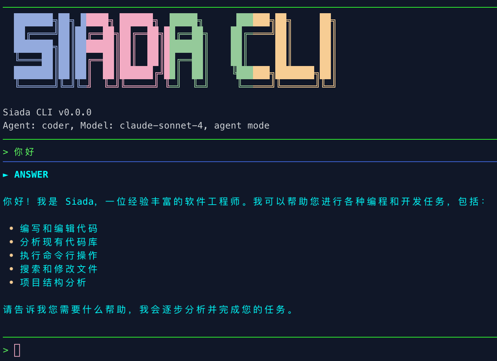

# Siada CLI

**简体中文 | [English](../../README.md)**



本仓库包含 Siada CLI，这是一个命令行 AI 工作流工具，为代码开发、调试和自动化任务提供专业化的智能代理。

使用 Siada CLI 您可以：

- 通过智能分析和自动化解决方案修复大型代码库中的错误。
- 使用专业化的前端和后端代理生成新的应用程序和组件。
- 通过智能代码生成和测试自动化开发工作流程。
- 执行系统命令并与开发环境交互。
- 无缝支持多种编程语言和框架。

## 安装/更新

1. 系统要求
- MAC、 Linux
- GCC 11+

2. 安装命令
   待补充

## 安装（开发者模式）

1. **前提条件：** 确保您已安装 [Python 3.12](https://www.python.org/downloads/) 或更高版本以及 [Poetry](https://python-poetry.org/docs/#installation)。

2. **克隆并安装：**
   ```bash
   git clone https://github.com/your-org/siada-agenthub.git
   cd siada-agenthub
   poetry install
   ```

3. **运行 CLI：**
   ```bash
   # 方法1：使用 Poetry 运行
   poetry run siada-cli
   
   # 方法2：激活虚拟环境后使用（推荐）
   source $(poetry env info --path)/bin/activate
   siada-cli
   ```

## 配置

### 模型配置

**方法1：默认配置**
   - 系统从 `agent_config.yaml` 文件读取默认配置
   - 当前默认：模型 `claude-sonnet-4`，供应商 `openrouter`

   **方法2：通过配置文件自定义**
   - 普通用户
      - 编辑配置文件 `~/.siada-cli/conf.yaml`
         ```bash
         # 1. 在用户主目录下创建配置文件
         cd ~
         mkdir -p ~/.siada-cli
         touch ~/.siada-cli/conf.yaml

         # 2. 配置文件内容示例
         llm_config:
            model: "claude-sonnet-4"          # 更改为您想要的模型
            provider: "openrouter"
         ```
      - 在使用 OpenRouter 提供商时需要
        ```bash
           export OPENROUTER_API_KEY="your_openrouter_key"
        ```
   - 开发者模式
      - 编辑 `agent_config.yaml` 文件中的 `llm_config` 部分：
         ```yaml
         llm_config:
            provider: "openrouter"
            model_name: "claude-sonnet-4"     # 更改为您想要的模型
         ```

   **方法3：通过环境变量**
   ```bash
   # 设置模型
   export SIADA_MODEL="claude-sonnet-4"
   
   # 设置供应商
   export SIADA_PROVIDER="openrouter"

   # 在使用 OpenRouter 提供商时需要
   export OPENROUTER_API_KEY="your_openrouter_key"
   ```

   **方法4：通过命令行参数（最高优先级）**
   ```bash
   # 仅更改模型（保持供应商不变）
   siada-cli --model claude-sonnet-4
   
   # 同时更改模型和供应商
   siada-cli --model gpt-4.1 --provider openrouter
   
   # 仅更改供应商（保持模型不变）
   siada-cli --provider openrouter
   ```

   > **重要提醒：**
   > - **完整优先级**：`命令行参数` > `环境变量(SIADA_前缀)` > `配置文件(agent_config.yaml)`
   > - **供应商要求**：使用 `openrouter` 时必须设置 `OPENROUTER_API_KEY` 环境变量

### 代理配置(开发者模式)

编辑 `agent_config.yaml` 以自定义代理行为：

```yaml
agents:
  bugfix:
    class: "siada.agent_hub.coder.bug_fix_agent.BugFixAgent"
    description: "专门用于代码错误修复的代理"
    enabled: true

llm_config:
  provider: "openrouter"
  model_name: "claude-sonnet-4"
  repo_map_tokens: 8192
  repo_map_mul_no_files: 16
  repo_verbose: true
```

### 环境变量

设置环境变量来配置行为：

```bash
# Siada 特定设置（使用 SIADA_ 前缀）
export SIADA_AGENT="bugfix"
export SIADA_MODEL="claude-sonnet-4"
export SIADA_THEME="dark"

# 在使用 OpenRouter 提供商时需要
export OPENROUTER_API_KEY="your_openrouter_key"

# 在当前终端会话中取消环境变量
unset SIADA_MODEL
```

## 使用模式

Siada CLI 支持两种使用模式，满足不同的使用场景：

### 非交互模式

**特点：**
- 一次性执行：执行单个任务后自动退出
- 无状态：不保留会话上下文
- 适用场景：自动化脚本、CI/CD 流水线、单次任务执行

**使用方法：**
```bash
# 使用 --prompt 参数触发非交互模式
siada-cli --agent bugfix --prompt "修复 auth.py 中的登录错误"

# 组合其他参数
siada-cli --agent coder --model claude-sonnet-4 --prompt "创建一个 REST API 端点"
```

### 交互模式

**特点：**
- 持续对话：启动后保持会话状态，可以连续对话
- 上下文记忆：AI 记住之前的对话内容
- 实时交互：支持斜杠命令、编辑器模式等高级功能
- 适用场景：探索性编程、复杂任务、需要多轮对话的开发工作

**使用方法：**
```bash
# 直接启动（默认为交互模式）
siada-cli --agent coder
```

**交互过程：**
```
> 创建一个用户管理 API
[AI 响应...]
> 为这个 API 添加数据验证
[AI 响应...]
> 写一些单元测试
[AI 响应...]
```

## 命令行选项

```bash
# 使用特定代理
siada-cli --agent coder
# 支持缩写
siada-cli -a coder

# 使用单个提示的非交互模式
siada-cli --prompt "修复 login.py 中的认证错误"
# 支持缩写
siada-cli -p "修复 login.py 中的认证错误"

# 使用不同模型
siada-cli --model claude-sonnet-4

# 明确使用 OpenRouter 供应商（需要设置 API 密钥）
siada-cli --provider openrouter

# 设置颜色主题
siada-cli --theme dark

# 启用详细输出
siada-cli --verbose

# 列出所有可用模型
siada-cli --list-models
siada-cli --models
```

## 斜杠命令

在 CLI 中，您可以使用斜杠命令来获得额外功能：

- `/shell` - 切换到 shell 模式执行系统命令（输入 `exit` 或 `quit` 退出 shell 模式）
- `/models` - 列出可用的 AI 模型
- `/run <命令>` 或 `!<命令>` - 执行 shell 命令
- `/editor` - 打开编辑器进行多行输入
- `/exit` 或 `/quit` - 退出应用程序

### Shell 模式使用说明

Siada CLI 提供两种方式执行系统命令：

#### 方式一：使用 `/shell` 切换到 shell 模式
切换到持续的 shell 模式，在此模式下可以连续执行多个系统命令：

```bash
> /shell
# 进入 shell 模式后可以执行多个命令
ls -la
cd my-project
npm install
git status
# 使用 exit 或 quit 退出 shell 模式
exit
```

#### 方式二：使用 `!` 前缀直接执行命令
在交互模式下直接执行单个系统命令，无需切换模式：

```bash
> !ls -la
> !git status
> !npm run dev
```

两种方式的区别：
- **`/shell`**：适合需要连续执行多个系统命令的场景，一次切换持续使用
- **`!<命令>`**：适合偶尔执行单个系统命令的场景，执行完立即返回 AI 对话模式

## 代理类型

### 错误修复代理 (`--agent bugfix` / `-a bugfix` / `--bugfix`) 
> **仅支持在非交互模式下使用！**

专门用于识别、分析和修复代码库中的错误。提供详细分析和自动修复建议。

### 代码生成代理 (`--agent coder` / `-a coder` / `--coder`)
通用代码开发代理，用于创建新功能、重构代码以及在各种编程语言中实现功能。

### 前端生成代理 (`--agent fegen` / `-a fegen` / `--fegen`)
专注于前端开发任务，包括 React 组件、CSS 样式和用户界面实现。

## 示例

### 激活虚拟环境（仅开发者模式需要）
首先，进入 siada-agenthub 项目目录并激活虚拟环境：

```bash
# 进入项目目录
cd ~/path/to/siada-agenthub

# 激活虚拟环境（推荐方法）
source $(poetry env info --path)/bin/activate

# 或者使用 Poetry 运行（无需激活环境）
# poetry run siada-cli
```

### 使用示例

激活环境后，您可以选择交互模式或非交互模式与 AI 代理进行交互。

**交互模式（默认）：**

```bash
# 进入项目目录
cd my-project/

# 启动交互模式
siada-cli --agent coder

# 然后您可以在交互界面中输入提示
> 使用 FastAPI 创建一个带有用户认证的 REST API 服务器
# AI 会响应并可以继续对话...
> 为这个 API 添加日志记录功能
```

**非交互模式（一次性执行）：**

```bash
# 直接执行单个任务并退出（默认使用 coder agent）
siada-cli --prompt "创建一个用户注册 API"

# 指定特定代理执行任务
siada-cli --agent bugfix --prompt "修复 login.py 中的认证错误"
siada-cli --agent fegen --prompt "使用 React 和 Tailwind CSS 创建一个响应式导航栏组件"
```

**退出虚拟环境（仅开发者模式需要）：**

```bash
# 使用完毕后退出虚拟环境
deactivate
```

## 常见任务

### 调试和修复代码问题

```text
> 分析这个错误消息并建议修复方案：[粘贴错误]
```

```text
> 帮我重现这个在高负载期间出现的间歇性错误
```

### 代码生成和开发

```text
> 为此服务中的数据库查询实现缓存层
```

```text
> 将这个单体函数重构为更小、更易维护的部分
```

### 前端开发

```text
> 创建一个带有侧边栏导航的响应式仪表板布局
```

```text
> 为用户注册表单添加表单验证
```

## 故障排除

### 常见问题

**命令找不到 (command not found)：**
如果直接运行 `siada-cli` 提示命令找不到：
- 在开发者模式中是正常现象，因为命令安装在虚拟环境中
- 参考示例激活虚拟环境

**模型 API 错误：**
- 检查您的网络连接
- 如果使用 OpenRouter 提供商，确保 API 密钥设置正确
- 如果使用 OpenRouter 提供商，验证您的账户有足够的积分

**安装问题：**
- 确保您安装了 Python 3.12+
- 使用官方安装方法安装 Poetry
- 尝试删除 `poetry.lock` 并重新运行 `poetry install`

**代理无法工作：**
- 检查代理在 `agent_config.yaml` 中是否启用
- 验证代理类路径是否正确
- 使用 `--verbose` 标志查看详细输出

有关更详细的故障排除，请检查日志并使用 `--verbose` 标志获取额外的调试信息。

## 贡献指南

我们欢迎对 Siada CLI 的贡献！无论您想修复错误、添加新功能、改进文档还是提出改进建议，我们都非常感谢您的贡献。

要开始贡献，请阅读我们的[贡献指南](./docs/zh-CN/CONTRIBUTING_zh.md)，其中包括：

- 我们的项目愿景和开发目标
- 项目目录结构和开发指南
- 拉取请求指南和最佳实践
- 代码组织原则

在提交任何更改之前，请确保检查我们的问题跟踪器并遵循指南中概述的贡献工作流程。

## 致谢

Siada CLI 的建设离不开众多开源项目的支持，我们对这些项目的贡献者深表敬意与感谢。

特别感谢 [OpenAI Agent SDK](https://github.com/openai/openai-agent-sdk) 为我们的智能代理功能提供了基础框架支持。

有关 Siada CLI 中使用的开源项目和许可证清单，请查看我们的[CREDITS_zh.md](./CREDITS_zh.md)文件。

## 许可证

本项目采用 MIT 许可证分发。更多信息请参见 [`LICENSE`](../../LICENSE)。

----
<div align="center">
由理想汽车代码智能团队和开源社区倾情打造
</div>
