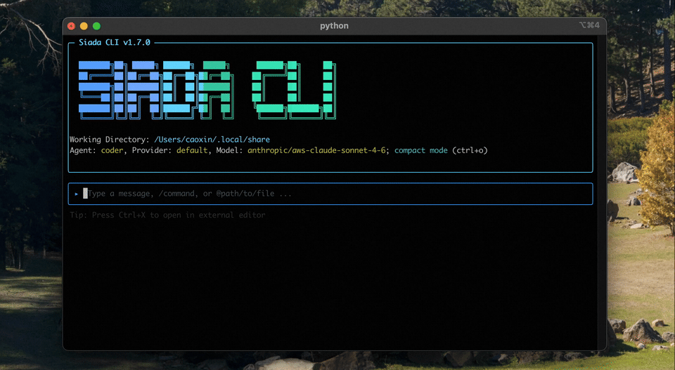

# Siada CLI

**简体中文 | [English](../../README.md)**

[](https://pypi.org/project/siada-cli/)
[](https://www.python.org/downloads/)
[](../../LICENSE)



本仓库包含 **Siada CLI**，这是一个命令行 AI 工作流工具，为代码开发、调试和自动化任务提供专业化的智能代理。

Siada CLI 可感知用户的**项目上下文**、**计算机环境**与**跨会话持久记忆**，并支持 Terminal、飞书、ACP 客户端、Web 等多种入口，提供一致、可持续的个性化智能辅助。

> **当前最新版本：v1.7.21**

---

## v1.7.21 新特性

### 1. 跨平台扩展与生态兼容

- **真正的跨平台** — 完整支持 **macOS、Linux、Windows**，三端体验一致。不是"POSIX 工具 + 兼容层"：命令执行按平台原生实现（Unix 走 `pexpect` PTY，Windows 自动识别 **PowerShell / cmd**），终端主题探测、系统通知、IPC（Unix socket 与 **命名管道**）、守护进程拉起、`ripgrep` 二进制、Node UI 引导均有各平台专属路径。
- **原生支持飞书（Lark）Bot** — 内置 Bot 通道，带流式卡片与输入状态提示，无需任何胶水代码即可在聊天中驱动 Siada。参见[远程控制指南](./remote_control_lark_zh.md)。
- **ACP 原生** — 提供独立的 [Agent Client Protocol](https://agentclientprotocol.com/) 服务（`siada-acp`），可自由接入 Zed、Kiro、vscode-acp 、微信、飞书等任意 ACP 生态客户端。终端、聊天、编辑器、Web 共用同一内核。

### 2. 把模型性能榨到极致

- **对齐一线水平** — 在 Claude、GPT 系列模型上，真实代码生成与缺陷修复效果与 Claude Code、Codex 等现有编码工具持平。
- **面向国产/开源模型深度优化** — 针对 **GLM-5.2**、**DeepSeek V4 Flash / Pro**、**Kimi**、**Qwen** 做了专门工程化：多轮工具调用间的 reasoning 内容回放、按模型映射 thinking 参数、按模型设定上下文与 token 预算，以及对快速模型的幻觉工具名与重复调用循环的抑制。

### 3. 长周期执行与自我迭代记忆

- **长周期任务执行** — 自动判定任务复杂度，Spec 驱动的 Research → Plan → Act 流水线，子 Agent 独立上下文编排，配合 Checkpoint 与自动压缩，可在数百步的任务链上保持目标不漂移。
- **自我迭代的记忆** — 跨会话持久记忆 + **结构化事实库**（实体抽取、全息 HRR 向量检索、信任度评分、矛盾检测），并有后台复盘与更新流水线。记忆不是只增不减的日志，而是会被打分、纠正与淘汰。

---

## Siada CLI 能做什么

- **代码生成** — 创建新功能、Web 界面、重构代码，支持多种编程语言
- **错误修复** — 自动识别、分析和修复大型代码库中的代码缺陷
- **长周期任务执行** — 通过 Spec 驱动执行与子 Agent 编排，稳定完成跨越多步骤的复杂开发任务
- **自我进化** — 持久记忆、事实库与定时主动任务，让助手持续进化
- **主机管理** — 支持对个人电脑、文档的远程管理与处理
- **多入口支持** — 终端（交互/非交互）、飞书 Bot、ACP 客户端、Web 界面

---

## 安装与更新

### 系统要求

| 要求 | 详情 |
|---|---|
| 操作系统 | macOS、Linux、Windows |
| Python | 3.12 – 3.13 |
| GCC | 11+（macOS / Linux） |
| 包管理器 | [uv](https://github.com/astral-sh/uv) |

### 安装

**第一步：安装 uv**

macOS / Linux：
```bash
curl -LsSf https://astral.sh/uv/install.sh | sh
```

Windows（PowerShell）：
```powershell
powershell -ExecutionPolicy ByPass -c "irm https://astral.sh/uv/install.ps1 | iex"
```

**第二步：安装 Siada CLI**（各平台命令一致）
```bash
uv tool install --force --python python3.12 --compile --with pip siada-cli@latest
```

安装后若 `siada-cli` 不在 PATH 中，运行以下命令更新 shell：
```bash
uv tool update-shell
```

### 更新
```bash
uv tool upgrade siada-cli
```

### 卸载
```bash
uv tool uninstall siada-cli
```

---

## 开发者模式安装

1. **前提条件：** 确保已安装 [Python 3.12+](https://www.python.org/downloads/) 和 [Poetry](https://python-poetry.org/docs/#installation)。

2. **克隆并安装：**
   ```bash
   git clone https://github.com/liauto-siada/siada-cli.git
   cd siada-cli
   poetry install
   ```

3. **构建 UI（首次运行前必须）：**
   ```bash
   cd siada_cli_ui && npm ci && npm run build:all && cd ..
   ```

4. **运行 CLI：**
   ```bash
   # 方法1：使用 Poetry 运行
   poetry run siada-cli

   # 方法2：激活虚拟环境后使用（推荐）
   source $(poetry env info --path)/bin/activate
   siada-cli
   ```

---

## 配置

### 快速模型配置

首次启动时，Siada CLI 会引导你完成交互式配置——选择供应商、选择模型、输入 API Key，即可开始使用，无需手动编辑任何配置文件。

如需高级配置（配置文件、环境变量、命令行参数），请参阅[用户手册](./USERMANUAL_zh.md)。

如需配置自定义外部模型（私有化部署），请参阅[外部模型配置指南](./external_model_configuration_zh.md)。

---

## 使用模式

### 交互模式（持续对话）
```bash
siada-cli
```

### 非交互模式（脚本 / CI 集成）
```bash
siada-cli --no-interactive "修复 src/main.py 中的空指针异常"
```

### 飞书（Lark）Bot
将 Siada CLI 连接到飞书工作空间，通过消息远程下发任务，原生支持流式回复。详见[飞书远程控制使用指南](./remote_control_lark_zh.md)。

### ACP 模式（编辑器 / 三方客户端）
以 Agent Client Protocol 对外提供服务，可被任意 ACP 客户端接入：
```bash
siada-acp
```
或以 ACP 方式启动内置 UI：
```bash
siada-cli --acp
```

---

## 核心特性

### 记忆系统与事实库
跨会话持久记忆让 Siada 记住你的偏好、代码库上下文和历史决策。在此之上，结构化事实库会抽取命名实体、通过全息（HRR）向量检索、根据反馈维护信任度评分并检测矛盾——知识是被不断提炼的，而不只是被不断堆积。

### Checkpoint 检查点
在关键决策点保存和恢复 Agent 状态，让你对长时任务保持完全掌控。

### Skills（技能系统）
以 `SKILL.md` 文件形式定义可复用的指令集和工作流，将其扩展为针对你的领域或团队规范的专用能力。详见 [Skills 文档](../SKILLS.md)。

### MCP 支持
通过 [Model Context Protocol (MCP)](https://modelcontextprotocol.io/) 连接外部工具服务，按需扩展 Siada 的工具集。

### 守护进程与定时任务
以后台守护进程模式运行，执行主动式定时自动化任务。

### 指令上下文（规则文件）
在项目或家目录中放置 `siada_rule.md` 或 `.siadarules/` 文件，持久化设定 AI 行为规则，无需在每次对话中重复说明。

### 自动压缩
智能压缩对话历史，在不丢失关键上下文的前提下保持在模型上下文限制内。详见[压缩策略配置](./compaction_configuration_zh.md)。

### 平台感知的工具执行
工具执行会适配宿主操作系统，而不是假定单一环境：macOS/Linux 使用基于 PTY 的 Shell，Windows 自动识别 PowerShell/cmd，按平台分发 `ripgrep` 二进制，使用原生系统通知，并按操作系统选择 IPC 与守护进程方案。提示词中也会携带探测到的操作系统信息，让模型生成的命令在你的机器上真正可执行。

---

## 文档目录

| 文档 | 说明 |
|---|---|
| [用户手册](./USERMANUAL_zh.md) | 完整使用指南、命令参考与配置说明 |
| [Skills 系统文档](../SKILLS.md) | 创建和管理可复用 AI 技能 |
| [外部模型配置](./external_model_configuration_zh.md) | 配置私有/自定义模型端点 |
| [飞书远程控制](./remote_control_lark_zh.md) | 通过飞书消息控制 Siada |
| [压缩策略配置](./compaction_configuration_zh.md) | 上下文压缩策略设置 |
| [贡献指南](./CONTRIBUTING_zh.md) | 如何为本项目做贡献 |

---

## 贡献指南

我们欢迎对 Siada CLI 的贡献！无论您想修复错误、添加新功能、改进文档还是提出改进建议，我们都非常感谢。

提交前请阅读[贡献指南](./CONTRIBUTING_zh.md)，其中包含：

- 项目愿景和开发目标
- 项目目录结构和开发规范
- Pull Request 指南和最佳实践
- 代码组织原则

---

## 致谢

Siada CLI 的建设离不开众多优秀开源项目的支持，我们对这些项目的贡献者深表敬意与感谢。

特别感谢：
- [OpenAI Agents SDK](https://github.com/openai/openai-agents-python) — 提供核心 Agent 框架
- [LiteLLM](https://github.com/BerriAI/litellm) — 统一的大模型提供商接口
- [OpenHands ACI](https://github.com/All-Hands-AI/OpenHands) — Agent 与计算机交互工具集
- [Gemini CLI](https://github.com/google-gemini/gemini-cli) — 终端原生 AI Agent 设计的重要参考

有关 Siada CLI 中使用的完整开源项目和许可证清单，请查看 [CREDITS_zh.md](./CREDITS_zh.md)。

---

## 许可证

本项目采用 [Apache 2.0 许可证](../../LICENSE) 分发。

## 免责声明

请参阅 [disclaimers.md](../../docs/disclaimers.md)。

---

<div align="center">
由理想汽车代码智能团队和开源社区倾情打造
</div>
