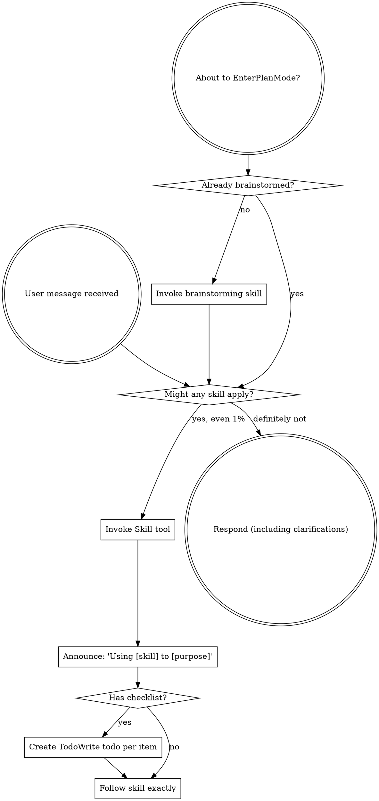

<SUBAGENT-STOP>
If you were dispatched as a subagent to execute a specific task, skip this skill.
</SUBAGENT-STOP>

<EXTREMELY-IMPORTANT>
If you think there is even a 1% chance a skill might apply to what you are doing, you ABSOLUTELY MUST invoke the skill.

IF A SKILL APPLIES TO YOUR TASK, YOU DO NOT HAVE A CHOICE. YOU MUST USE IT.

This is not negotiable. This is not optional. You cannot rationalize your way out of this.
</EXTREMELY-IMPORTANT>

# Long-Horizon Task Mode

This skill has two layers:

1. **Always-on base layer** — mandatory skill invocation rules that apply to every conversation.
2. **Long-horizon pipeline layer** — activated only when the user explicitly invokes long-horizon mode (via slash command or explicit request). Enforces a strict 3-phase pipeline: RESEARCH → PLAN → ACT.

---

## Part 1: Using Skills (Always Active)

### The Rule

**Invoke relevant or requested skills BEFORE any response or action.** Even a 1% chance a skill might apply means you must invoke it to check. If an invoked skill turns out to be wrong for the situation, you don't need to follow it.

**When the task is considered complex or the user explicitly requests long-horizon mode, the 3-phase pipeline defined in Part 2 is mandatory. This definitively indicates the user wants you to research, clarify, plan, and only then execute.**



### Red Flags — Skill Invocation

These thoughts mean STOP — you are rationalizing:

| Thought | Reality |
|---------|---------|
| "This is just a simple question" | Questions are tasks. Check for skills. |
| "I need more context first" | Skill check comes BEFORE clarifying questions. |
| "Let me explore the codebase first" | Skills tell you HOW to explore. Check first. |
| "I can check git/files quickly" | Files lack conversation context. Check for skills. |
| "Let me gather information first" | Skills tell you HOW to gather information. |
| "This doesn't need a formal skill" | If a skill exists, use it. |
| "I remember this skill" | Skills evolve. Read current version. |
| "This doesn't count as a task" | Action = task. Check for skills. |
| "The skill is overkill" | Simple things become complex. Use it. |
| "I'll just do this one thing first" | Check BEFORE doing anything. |
| "I know what that means" | Knowing the concept ≠ using the skill. Invoke it. |


### Skill Types

**Rigid** (TDD, debugging): Follow exactly. Don't adapt away discipline.
**Flexible** (patterns): Adapt principles to context.

The skill itself tells you which.

### Instruction Priority

1. **User's explicit instructions** (CLAUDE.md, GEMINI.md, AGENTS.md, direct requests) — highest priority
2. **Skills** — override default system behavior where they conflict
3. **Default system prompt** — lowest priority

---

## Part 2: Long-Horizon Pipeline (Activated Explicitly)

This section activates when the user explicitly invokes long-horizon mode via slash command or explicit request.

<ABSOLUTE-REQUIREMENT>
This mode enforces a strict 3-phase pipeline. No phase can be skipped, shortened, or reordered:

**INDEX → DESIGN → ACT**

Do NOT write any code, make any file change, or take any implementation action until INDEX and DESIGN are both complete and user-approved. There is no "simple enough to skip" exception.
</ABSOLUTE-REQUIREMENT>

---

## Step 0: Language Detection (Do This First)

Identify the language of the user's task description.

- Chinese task → ALL outputs (questions, documents, commit messages) MUST be in Chinese.
- English task → ALL outputs MUST be in English.
- Mixed → use the dominant language.

**Locked for the entire session.** Applies to every document, question, and phase.

---

## Document Artifacts (Hardcoded Paths)

Three documents MUST be produced and maintained throughout the pipeline:

| Document | Hardcoded Path | What it contains |
|---|---|---|
| Index | `design_docs/index/{YYYY-MM-DD}_{Task_Description}_index.md` | Task decomposition — ordered sub-steps with goals and dependencies |
| Spec (per sub-step) | `design_docs/spec/{YYYY-MM-DD}_{Task_Description}_{Step_Description}_spec.md` | What to build — architecture, interfaces, data flows, constraints |
| Plan (per sub-step) | `design_docs/plan/{YYYY-MM-DD}_{Task_Description}_{Step_Description}_plan.md` | How to build it — bite-sized implementation tasks |

These paths are fixed. No exceptions.

<HARD-RULE>
Re-read the relevant Spec file immediately after any context loss or session restart. Update the relevant Plan file immediately after any task status change. These files are the source of truth — never treat them as write-once.
</HARD-RULE>

---

## Rules Applying to All Phases

**Incremental document writing:** Never generate a document in a single output. Always: create file with header → append one section at a time → confirm after each section. Never attempt to produce the full document in one generation.

**Parallel dispatch:** Whenever there are 2 or more independent tasks with no shared state or ordering dependency, read the `dispatching-parallel-agents` skill and call `use_subagents` — one sub-agent per independent task. Each sub-agent gets a fully self-contained instruction with its scope, output path, and required skills. Wait for all to complete before proceeding. Applies to codebase exploration, spec writing, plan writing, and implementation.

**Ambiguity gate:** At any point — if scope is undefined, success criteria are missing, requirements conflict, or a statement has multiple valid interpretations — STOP and ask. One question per message. Do NOT assume. Do NOT guess.

---

## Phase 1 — INDEX

**Goal:** User's task description → index document.

**Skills used:** `brainstorming`, `dispatching-parallel-agents` (when parallel exploration is useful)

**Output:**
```
design_docs/index/{YYYY-MM-DD}_{Task_Description}_index.md
```

The index contains:
- A brief summary of the task and its scope
- An ordered list of sub-steps, each with: name, goal, and dependencies on other steps
- Assumptions made during research
- Decisions resolved through user clarification

### Execution

**1. Invoke brainstorming** (MANDATORY)

Announce: `[Long-Horizon / Phase 1: INDEX] Invoking brainstorming skill.`

Instruct brainstorming to:
- Investigate the codebase and understand the current state
- Surface and resolve all task-level ambiguities with the user (one question at a time)
- Produce an index document to `design_docs/index/{YYYY-MM-DD}_{Task_Description}_index.md`

If multiple independent areas of the codebase must be explored simultaneously, use parallel dispatch via `use_subagents`.

**2. User approves the index**

Wait for explicit user approval. Only proceed to Phase 2 after approval.

---

## Phase 2 — DESIGN

**Goal:** Each sub-step in the index → one Spec + one Plan.

**Skills used:** `brainstorming` (spec), `writing-plans` (plan), `dispatching-parallel-agents` (when parallel is useful)

**Output per sub-step:**
```
design_docs/spec/{YYYY-MM-DD}_{Task_Description}_{Step_Description}_spec.md
design_docs/plan/{YYYY-MM-DD}_{Task_Description}_{Step_Description}_plan.md
```

Spec = what to build. Plan = how to build it. These are separate documents. One sub-step = two files, always.

### Sub-phase 2a — Specs (brainstorming, with research + clarification)

Announce: `[Long-Horizon / Phase 2a: SPEC] Invoking brainstorming skill per sub-step.`

For each sub-step in the index, invoke brainstorming. Instruct it to:
1. Conduct a scoped codebase investigation on files and modules relevant to this sub-step
2. Ask the user clarifying questions if any design decisions are unresolved
3. Produce the spec file to `design_docs/spec/{...}_spec.md`

**Parallel dispatch:** For sub-steps with no dependency, call `use_subagents` — one per sub-step. Sub-steps with dependencies wait for their prerequisite spec first.

After finishing each spec, check it against the index entry for that sub-step. Every module, feature, and file named in the index must either be covered in the spec or explicitly deferred to another sub-step with user approval. If anything is missing and not yet approved as a deferral, fix the spec before presenting it to the user.

Wait for user approval of all spec files before proceeding.

### Sub-phase 2b — Plans (writing-plans, research only)

Announce: `[Long-Horizon / Phase 2b: PLAN] Invoking writing-plans skill per sub-step.`

For each sub-step, invoke writing-plans. Instruct it to:
1. Read the spec file from Sub-phase 2a
2. Investigate the code files the plan will touch (no user clarification — spec is already approved)
3. Produce the plan file to `design_docs/plan/{...}_plan.md`

**Parallel dispatch:** Same rule — `use_subagents` for independent sub-steps.

After finishing each plan, check it against the spec for that sub-step. Every requirement in the spec must map to at least one task in the plan. If anything is missing, add it before presenting the plan to the user.

Wait for user approval of all plan files before proceeding to Phase 3.

---

## Phase 3 — ACT

**Goal:** Each sub-step's plan → working implementation.

**Skills used:** `executing-plans`, `dispatching-parallel-agents` (when parallel is useful)

**Optional skills (use as needed during implementation):**
- `finishing-a-development-branch` — wrap up and merge
- `receiving-code-review` — respond to review feedback
- `requesting-code-review` — request review before merging
- `subagent-driven-development` — dispatch sub-agents per task
- `systematic-debugging` — debug unexpected failures
- `test-driven-development` — write tests before implementation
- `using-git-worktrees` — isolate work in a clean branch
- `verification-before-completion` — verify all criteria before claiming done

### Execution

Announce: `[Long-Horizon / Phase 3: ACT] Invoking executing-plans skill.`

For each sub-step plan, invoke executing-plans and implement task by task, following the order and dependencies defined in the index.

**Parallel dispatch:** For sub-steps with no dependency, call `use_subagents` — one per sub-step plan. Each sub-agent runs executing-plans on its assigned plan file.

**Executing each sub-step:**

- Before starting: read the plan file from disk.
- Work through tasks in order. Do not skip, reorder, or combine tasks.
- After completing each task: mark it `- [x]` in the plan file immediately. Do not batch updates.
- Do not deviate from the plan. If something in the plan turns out to be wrong or incomplete, stop and raise it — do not silently do something different.
- A task is only done when all its acceptance criteria pass. "Mostly done" does not count.

After all sub-steps are complete, re-read the index and verify every sub-step is done. Invoke `finishing-a-development-branch` to finalize.

---

## Red Flags — Pipeline Rationalization

| Thought | Reality |
|---|---|
| "The task is simple, I can skip INDEX" | Long-horizon mode was explicitly requested. No override. |
| "I already understand the sub-steps" | Write them in the index and get approval. Understanding ≠ permission. |
| "The user wants a quick answer" | They invoked long-horizon mode. They want the full process. |
| "I'll plan as I go" | Unplanned execution is exactly what this mode prevents. |
| "The spec is obvious from the index" | Write it. The plan must have a spec to be trustworthy. |
